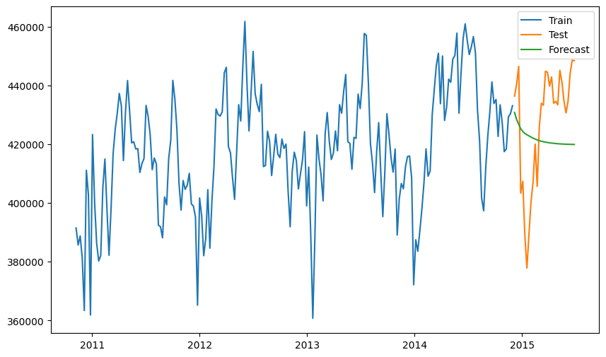

<!-- WARNING: THIS FILE WAS AUTOGENERATED! DO NOT EDIT! -->

# Peshbeen

This file will become your README and also the index of your
documentation.

If you are new to using `nbdev` here are some useful pointers to get you
started.

### Install in Development mode

``` sh
# make sure  package is installed in development mode
$ pip install -e .

# make changes under nbs/ directory
# ...

# compile to have changes apply to 
$ nbdev_prepare
```

### Installation

Install latest from the GitHub \[repository\]\[repo\]:

``` sh
$ pip install git+https://github.com//.git
```

or from \[conda\]\[conda\]

``` sh
$ conda install -c  
```

or from \[pypi\]\[pypi\]

``` sh
$ pip install 
```

\[repo\]: \[docs\]: https://.github.io// \[pypi\]:
https://pypi.org/project// \[conda\]: https://anaconda.org//

### Documentation

Documentation can be found hosted on this GitHub
\[repository\]\[repo\]’s \[pages\]\[docs\]. Additionally you can find
package manager specific guidelines on \[conda\]\[conda\] and
\[pypi\]\[pypi\] respectively.

\[repo\]: \[docs\]: https://.github.io// \[pypi\]:
https://pypi.org/project// \[conda\]: https://anaconda.org//

## How to use

Fill me in please! Don’t forget code examples:

``` python
1+1
```

    2

# Models

> API details

Peshbeen is …

``` python
from peshbeen.metrics import RMSE, MAE
```

``` python
MAE([3, -0.5, 2, 7], [2.5, 0.0, 2, 8])
```

    np.float64(0.5)

``` python
from peshbeen.datasets import load_nhs_attend
# split the data into train and test sets
train = load_nhs_attend[:-30]
test = load_nhs_attend[-30:]
```

``` python
from peshbeen.models import ml_forecaster
```

``` python
# import linear regression from sklearn
from sklearn.linear_model import LinearRegression
ml_linear = ml_forecaster(model=LinearRegression(),
              target_col='attend', lags = 7)
```

``` python
ml_linear.fit(train)
```

``` python
ml_linear.forecast(H=30)
```

    array([430796.7041251 , 428410.43400966, 426821.4107408 , 425222.28238429,
           424326.81261509, 423662.41365795, 423223.09618412, 422821.17942991,
           422415.76664768, 422068.11922156, 421747.36540958, 421464.13994277,
           421222.63819927, 421020.25542666, 420849.47190517, 420702.43079703,
           420576.84362351, 420469.04045579, 420375.80944133, 420295.35317043,
           420226.20137003, 420166.84067688, 420115.81185478, 420071.98653527,
           420034.37835101, 420002.07038525, 419974.29777864, 419950.43050693,
           419929.92365245, 419912.30021165])

``` python
# plot the forecast against the actual values
import matplotlib.pyplot as plt
plt.figure(figsize=(10, 6))
plt.plot(train.index, train['attend'], label='Train')
plt.plot(test.index, test['attend'], label='Test')
plt.plot(test.index, ml_linear.forecast(H=30), label='Forecast')
plt.legend()
plt.show()
```


