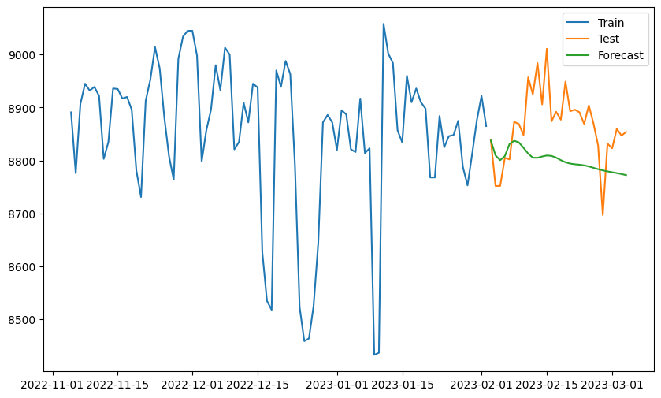

# peshbeen


<!-- WARNING: THIS FILE WAS AUTOGENERATED! DO NOT EDIT! -->


**peshbeen** is a easy-to-use Python library designed for time series
forecasting. It provides a simple and intuitive interface for building,
training, and evaluating forecasting models. It automatically handles
data preprocessing specific to time series data, making it easier for
users to focus on model development and evaluation. Peshbeen supports a
variety of forecasting models, including traditional statistical models
and modern machine learning approaches, including Linear Regression,
Random Forest, XGBoost, LightGBM, CatBoost, and Cubist.

## Why peshbeen

- **Automated Detrending Engine**: Seamlessly handles non-stationary
  data using global linear trends, piecewise linear regression (for
  structural breaks), or ETS (Exponential Smoothing) to capture evolving
  trend dynamics.

- **Broad Model Support:** Out-of-the-box compatibility with the leading
  tree-based and boosting architectures, including XGBoost, LightGBM,
  CatBoost, Random Forest, and AdaBoost.

- **Intelligent Optimization:** Leverages Bayesian Optimization
  (Hyperopt) to not only tune machine learning hyperparameters but also
  to optimize smoothing parameters for ETS detrending.

- **Uncertainty Quantification:** Goes beyond simple point forecasts
  with a suite of probabilistic approaches:

  - **Empirical Distributions:** Leveraged via boosting.

  - **KDE (Kernel Density Estimation):** For non-parametric forecast
    distribution modeling.

  - **Correlated Error Modeling:** Accounting for error dependencies
    across the forecast horizon.

  - **Conformal Prediction:** Distribution-free uncertainty estimates.

``` python
from peshbeen.datasets import load_wales_admissions
# split the data into train and test sets
train = load_wales_admissions[:-30]
test = load_wales_admissions[-30:]
```

``` python
from peshbeen.models import ml_forecaster
```

    /Users/aslanm/Desktop/my_desk/peshbeen/.venv/lib/python3.13/site-packages/hyperopt/atpe.py:19: UserWarning: pkg_resources is deprecated as an API. See https://setuptools.pypa.io/en/latest/pkg_resources.html. The pkg_resources package is slated for removal as early as 2025-11-30. Refrain from using this package or pin to Setuptools<81.
      import pkg_resources

``` python
# import linear regression from sklearn
from sklearn.linear_model import LinearRegression
ml_linear = ml_forecaster(model=LinearRegression(),
              target_col='admissions', lags = 7)
```

``` python
ml_linear.fit(train)
```

``` python
ml_linear.forecast(H=30)
```

    array([8837.64012317, 8809.61409562, 8800.56549201, 8808.3564168 ,
           8831.16805604, 8837.29675557, 8834.15615162, 8824.03294077,
           8813.03281712, 8805.24801163, 8805.10516068, 8807.59985417,
           8809.44916909, 8808.68920192, 8805.40625265, 8800.62432546,
           8796.6095056 , 8794.15334057, 8792.93850576, 8792.08382984,
           8790.84528641, 8788.81540179, 8786.25136535, 8783.64463352,
           8781.3601215 , 8779.47089754, 8777.8324959 , 8776.19551565,
           8774.39826787, 8772.43408096])

``` python
# plot the forecast against the actual values
import matplotlib.pyplot as plt
plt.figure(figsize=(10, 6))
plt.plot(train.index[-90:], train['admissions'][-90:], label='Train')
plt.plot(test.index, test['admissions'], label='Test')
plt.plot(test.index, ml_linear.forecast(H=30), label='Forecast')
plt.legend()
plt.show()
```


