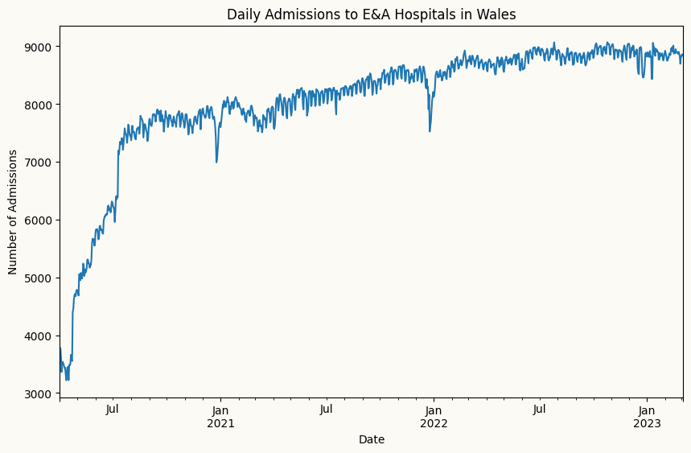
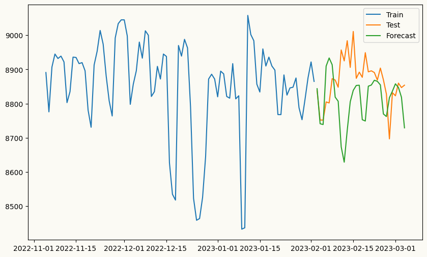

<!-- WARNING: THIS FILE WAS AUTOGENERATED! DO NOT EDIT! -->


[](https://pypi.org/project/peshbeen/)
[](https://pypi.org/project/peshbeen/)
[](https://github.com/mustafaslanCoto/peshbeen/blob/main/LICENSE)
[](https://pypistats.org/packages/peshbeen)
[](https://github.com/mustafaslanCoto/peshbeen/stargazers)

**peshbeen** is a Python forecasting library built around a single idea:
the forecasting workflow should be the same regardless of the model. The
name draws from Kurdish — pesh (“front”) and been (“to see/be”) —
combining to mean foresight. The library provides a unified interface
spanning a wide range of models: from ARIMA and Vector Autoregressions
to scikit-learn regressors and gradient-boosted trees (XGBoost,
LightGBM, CatBoost). Whether you’re working with univariate or
multivariate time series, peshbeen automates the heavy lifting — feature
engineering, lag generation, and stationarity transformations — so you
can focus on forecasting.

## Key Features

- **Unified API:** Train any model using a simple `.fit(df)` and
  `.forecast(H)` workflow, eliminating the need for manual
  feature/target splitting.

- **Model Agnostic:** Supports a wide range of forecasting models,
  including ETS, ARIMA, Vector Autoregressions, scikit-learn regressors,
  and gradient-boosted trees (XGBoost, LightGBM, CatBoost).

- **Automatic Feature Engineering:** User can specify the key following
  parameters to automatically generate features:

  - `lags`: List of lag periods to create lag features.
  - `rolling_windows`: List of window sizes for rolling statistics to
    create rolling features (e.g., rolling mean, rolling std, rolling
    quantiles).
  - `trend removal`: Option to automatically difference the data or
    de-trend it using global trend, local trend, or piecewise linear
    trend. For piecewise linear trend, the user can specify the indexes
    of the breakpoints. For local trend, the user can pass ETS
    parameters to fit a local ETS model and use its fitted values as the
    local trend.
  - `boxcox`: Option to apply Box-Cox transformation to target variable
    to stabilize variance.

- **Multivariate Forecasting:** Supports forecasting with multiple
  target variables and exogenous regressors, making it suitable for
  multivariate forecasting tasks where relationships between variables
  can be leveraged for improved accuracy.

- **Probabilistic Forecasting:** Enables probabilistic forecasting
  through a simple two-step workflow. First, call `calibrate` with a
  held-out portion (calibration data) of your dataset — peshbeen uses
  the residuals at each horizon to fit the uncertainty model. Then call
  `sample` to generate forecast scenarios and prediction intervals,
  giving you a full picture of forecast uncertainty for risk assessment
  and decision-making.

  Four methods are implemented for generating probabilistic forecasts:

  - **Empirical & Kernel Density Estimation (KDE):** This method
    generates probabilistic forecasts by resampling from the empirical
    distribution of the residuals. By adding these resampled residuals
    to the point forecasts, we can create a distribution of possible
    future values. `KDE` can be applied to these resampled forecasts to
    obtain a smooth probability density function, which can then be used
    to derive prediction intervals and quantiles.

  - **Correlated Bootstrap:** This method generates probabilistic
    forecasts by resampling from the residuals while preserving the
    correlation structure across different forecast horizons. By
    resampling entire rows of residuals (i.e., all horizons together),
    we can maintain the temporal dependencies and correlations between
    forecast errors at different horizons, leading to more realistic
    forecast scenarios.

  - **Conformal Prediction:** This method generates probabilistic
    forecasts by applying conformal prediction techniques to the
    residuals. By calculating nonconformity scores based on the
    residuals and using them to determine prediction intervals.

- **Hyperparameter Tuning:** Provides built-in support for
  hyperparameter tuning using Hyperopt and Optuna, allowing users to
  optimize model performance with minimal effort.

## Installation

Installation requires Python 3.10 or higher.

### Core install

Installs only the essential dependencies (numpy, pandas, scipy,
scikit-learn, statsmodels):

``` bash
pip install peshbeen
```

### Optional dependencies

Install only what you need:

``` bash
pip install peshbeen[ml]        # XGBoost, LightGBM, CatBoost, Cubist
pip install peshbeen[tuning]    # Hyperopt, Optuna
pip install peshbeen[forecast]  # StatsForecast, Numba
pip install peshbeen[plotting]  # Matplotlib, Seaborn
pip install peshbeen[all]       # Everything above
```

## Quick Start Example

``` python
from peshbeen.datasets import load_wales_admissions # addmissions to E&A hospitals in Wales
from peshbeen.models import ml_forecaster
from peshbeen.transformations import rolling_mean, rolling_std, expanding_mean
from xgboost import XGBRegressor

wales_admissions = load_wales_admissions()
wales_admissions["day_of_week"] = wales_admissions.index.dayofweek # add day of week as a feature
wales_admissions["month"] = wales_admissions.index.month # add month as a feature to capture seasonality
wales_admissions["day_of_month"] = wales_admissions.index.day # add day of month as a feature to capture seasonality
# split the data into train and test sets
train = wales_admissions[:-30]
test = wales_admissions[-30:]
cat_variables = ["day_of_week", "month", "day_of_month"]
from sklearn.preprocessing import OneHotEncoder
ohe = OneHotEncoder(drop='first', sparse_output=False, handle_unknown="ignore")
transforms = [rolling_mean(window_size= 28, shift=7), rolling_std(window_size=28), expanding_mean()] 
# import linear regression from sklearn
from sklearn.linear_model import LinearRegression
ml_linear = ml_forecaster(model=XGBRegressor(),
              target_col='admissions', lags = 6,
              cat_variables=cat_variables, categorical_encoder=ohe,
              lag_transform=transforms)
ml_linear.fit(train)
forecasts = ml_linear.forecast(H=30, exog=test[cat_variables])
```

``` python
## Plot the historical data
import matplotlib.pyplot as plt
wales_admissions["admissions"].plot(figsize=(10, 6), label='Admissions')
plt.title("Daily Admissions to E&A Hospitals in Wales")
plt.xlabel("Date")
plt.ylabel("Number of Admissions")
plt.show()
```



``` python
# plot the forecast against the actual values
plt.figure(figsize=(10, 6))
plt.plot(train.index[-90:], train['admissions'][-90:], label='Train')
plt.plot(test.index, test['admissions'], label='Test')
plt.plot(test.index, forecasts, label='Forecast')
plt.legend()
plt.show()
```


