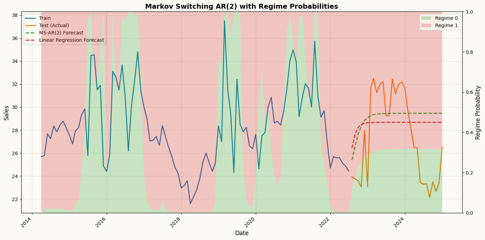
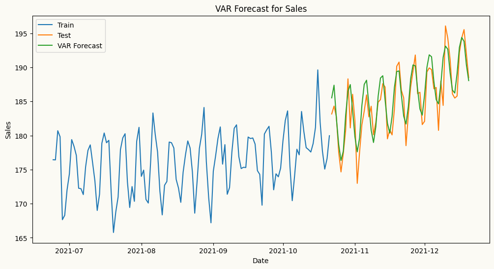
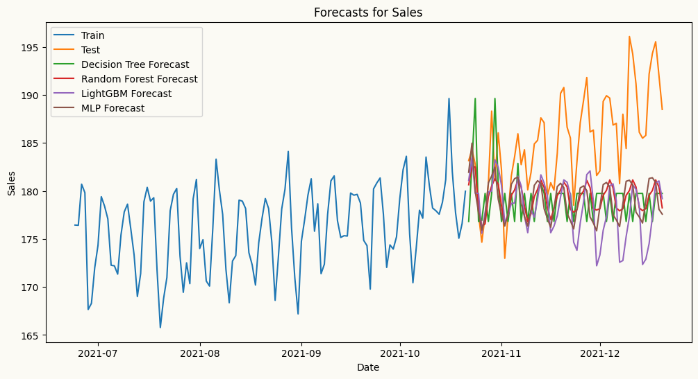
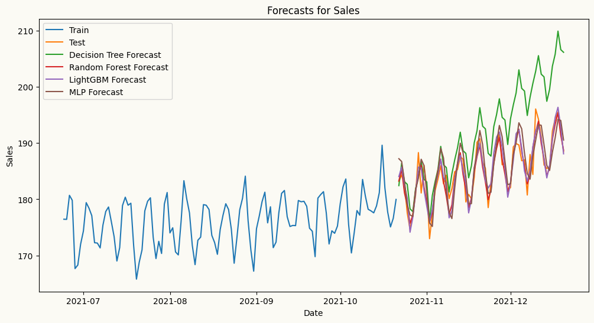

<!-- WARNING: THIS FILE WAS AUTOGENERATED! DO NOT EDIT! -->

## Models zoo

### Univariate forecasters

All models share a consistent interface — each accepts a target_col to
specify the target series, along with any model-specific parameters.
Fitting is done via .fit(df) and forecasting via .forecast(H). Exogenous
variables, where supported, are passed at the forecasting step and
aligned automatically. All models also expose .cross_validate() for
evaluation, supporting both expanding and sliding window strategies with
a configurable step size.

The table below summarises the available univariate forecasters, from
simple baselines to statistical and machine learning models, along with
a minimal usage example for each.

<table>
<colgroup>
<col style="width: 27%" />
<col style="width: 30%" />
<col style="width: 41%" />
</colgroup>
<thead>
<tr>
<th><strong>Models</strong></th>
<th><strong>Description</strong></th>
<th><strong>Usage Example</strong></th>
</tr>
</thead>
<tbody>
<tr>
<td>Naive Forecaster</td>
<td>A simple forecasting model that uses the last observed value or last
seasonal value as the forecast.</td>
<td><code> from peshbeen.models import naive <br> model =
naive(target_col=‘target column name’, season_period=None) <br>
model.fit(df) <br> forecasts = model.forecast(H=10)</td>
</tr>
<tr>
<td>ETS (Exponential Smoothing state space models)</td>
<td>ETS forecaster that wraps the <code>statsmodels</code>
implementation, allowing for easy integration and forecasting.</td>
<td><code> from peshbeen.models import ets <br> model =
ets(target_col=‘target column name’, trend=‘add’, seasonal=‘add’,
seasonal_periods=12, smoothing_level=0.1, smoothing_trend=0.1,
smoothing_seasonal=0.1) <br> model.fit(df) <br> forecasts =
model.forecast(H=10)</td>
</tr>
<tr>
<td>ARIMA (AutoRegressive Integrated Moving Average)</td>
<td>ARIMA — a fast, familiar forecaster backed by Nixtla’s
<code>statsforecast</code> implementation, the fastest ARIMA in
Python.</td>
<td><code> from peshbeen.models import arima <br> model =
arima(target_col=‘target column name’, order=(1, 1, 1)) <br>
model.fit(df) <br> forecasts = model.forecast(H=10)</td>
</tr>
<tr>
<td>Machine Learning Regressors — any scikit-learn-compatible regressor,
from LinearRegression, RandomForest and AdaBoost to XGBoost, LightGBM,
CatBoost and TabPFN.</td>
<td>A unified forecasting wrapper for any compatible regression
model.</td>
<td><code> from peshbeen.models import ml_forecaster <br> from
sklearn.ensemble import RandomForestRegressor <br> model =
ml_forecaster(target_col=‘target column name’,
estimator=RandomForestRegressor(n_estimators=100)) <br> model.fit(df)
<br> forecasts = model.forecast(H=10)</td>
</tr>
<tr>
<td>MS-ARR (Markov-Switching AutoRegressive Regression)</td>
<td>Models time series with hidden regime changes (e.g. recession
vs. growth, low vs. high volatility) using autoregressive dynamics and
optional exogenous variables.</td>
<td><code> from peshbeen.models import ms_arr <br> model =
ms_arr(target_col=‘target column name’, n_components=2, lags = 2,
n_iter=100) <br> model.fit(df) <br> forecasts =
model.forecast(H=10)</td>
</tr>
<tr>
<td>GLM (Generalized Linear Models)</td>
<td>A statsmodels-backed generalization of linear regression that
supports non-Gaussian response distributions — including Poisson for
count data and Gamma for strictly positive, skewed data.</td>
<td><code> from peshbeen.models import glm <br> model =
glm(target_col=‘target column name’, family=‘poisson’, lags=2) <br>
model.fit(df) <br> forecasts = model.forecast(H=10)</td>
</tr>
</tbody>
</table>

**Usage example**

Regardless of whether you use ETS, ARIMA, a machine learning regressor,
or any other supported model, the interface is consistent. The
.forecast(H) method returns a consistent numpy array of forecasts, and
the .cross_validate() method provides a standardized way to evaluate
model performance across different time series and forecasting horizons.

- **Index of data:** A `DatetimeIndex` (or `RangeIndex`) is required for
  all models to ensure proper time series handling and forecasting. The
  index is recommended to be at a regular frequency without any missing
  timestamps.

- **Target column:** The `target_col` parameter specifies the name of
  the column in the input DataFrame that contains the time series to be
  forecasted.

Example usage for different models are provided in cells below,
demonstrating how to fit and forecast with each model type using the
same dataset and target column for consistency.

``` python
from peshbeen.models import naive, ets, arima, ml_forecaster
from peshbeen.datasets import load_airline_passengers
from sklearn.ensemble import RandomForestRegressor
from lightgbm import LGBMRegressor

airline_passengers = load_airline_passengers()
train_data = airline_passengers[:-12]
test_data = airline_passengers[-12:]

## naive
naive_model = naive(target_col="passengers", season_period=12)
naive_model.fit(train_data)
naive_forecast = naive_model.forecast(H=12)

## ets
ets_model = ets(target_col="passengers", seasonal="additive", trend="additive", seasonal_periods=12,
                smoothing_level=0.5, smoothing_trend=0.5,smoothing_seasonal=0.5)
ets_model.fit(train_data)
ets_forecast = ets_model.forecast(H=12)

## arima
arima_model = arima(target_col="passengers", order=(1, 1, 1), seasonal_order=(1, 1, 1), seasonal_length=12)
arima_model.fit(train_data)
arima_forecast = arima_model.forecast(H=12)
## random forest
rf_model = ml_forecaster(target_col="passengers", model=RandomForestRegressor(n_estimators=100, random_state=42),
                         difference=1, lags=12)
rf_model.fit(train_data)
rf_forecast = rf_model.forecast(H=12)
## lightgbm
lgbm_model = ml_forecaster(target_col="passengers", model=LGBMRegressor(n_estimators=100, random_state=42, verbose=-1),
                           difference=1, lags=12)
lgbm_model.fit(train_data)
lgbm_forecast = lgbm_model.forecast(H=12)

## plotting
import matplotlib.pyplot as plt
plt.figure(figsize=(12, 6))
plt.plot(train_data.index, train_data["passengers"], label="Train", marker="o")
plt.plot(test_data.index, test_data["passengers"], label="Test", marker="o")
plt.plot(test_data.index, naive_forecast, label="Naive Forecast", marker="o")
plt.plot(test_data.index, ets_forecast, label="ETS Forecast", marker="o")
plt.plot(test_data.index, arima_forecast, label="ARIMA Forecast", marker="o")
plt.plot(test_data.index, rf_forecast, label="Random Forest Forecast", marker="o")
plt.plot(test_data.index, lgbm_forecast, label="LightGBM Forecast", marker="o")
plt.title("Airline Passengers Forecasting")
plt.xlabel("Date")
plt.ylabel("Number of Passengers")
plt.legend()
plt.grid()
plt.show()
```


#### **Forecasting with TabPFN**

TabPFN is a powerful transformer-based model designed for tabular data.
[`ml_forecaster`](https://mustafaslanCoto.github.io/peshbeen/modules/02_models/ml_forecast.html#ml_forecaster)
provides a wrapper to use TabPFN for time series forecasting by treating
the problem as a regression task. Below is an example of how to use
TabPFN for forecasting with the
[`ml_forecaster`](https://mustafaslanCoto.github.io/peshbeen/modules/02_models/ml_forecast.html#ml_forecaster)
wrapper.

``` python
import tabpfn_client
from tabpfn_client import TabPFNRegressor, set_access_token
TABPFN_TOKEN = "ENTER_YOUR_TOKEN_HERE"
tabpfn_client.set_access_token(TABPFN_TOKEN)

tabpfn_model = ml_forecaster(target_col="passengers", model=TabPFNRegressor(), lags=12, difference=1)
tabpfn_model.fit(train_data)
tabpfn_forecast = tabpfn_model.forecast(H=12)
```

#### **Forecasting with MS-ARR: Capturing Regime Changes**

Models like ARIMA or Random Forest assume the “rules” of a time series
are constant. However, real-world data often undergoes structural
shifts—moving between a high-volatility “crisis” mode and a stable
“growth” mode.

While the models above assume a stable relationship over time,
real-world data sometimes exhibits regime changes. Peshbeen includes
native support for MS-ARR to model these “regime changes” (e.g.,
shifting from a high-volatility to a low-volatility state) explicitly.
MS-ARR models capture these dynamics by allowing the time series to
switch between different hidden regimes, each with its own
autoregressive structure.

**How it Works: The Hidden Dynamics**

The AR-MSR model in peshbeen is defined by four core
components:Regime-Dependent Dynamics: In each regime *r*, the process
follows a unique autoregressive structure:

$$
y_t \mid (r_t = r) = \beta\_{0}^{(r)} + \sum\_{i=1}^{p} \beta\_{i}^{(r)} y\_{t-i} + \sum\_{m=1}^{M} \beta\_{m}^{(r)} X\_{tm} + \epsilon_t, \quad \epsilon_t \sim \mathcal{N}(0, \sigma_r^2)
$$

*y*<sub>*t*</sub> is the target variable at time *t*,
*X*<sub>*t**m*</sub> are optional exogenous variables, and
*ϵ*<sub>*t*</sub> is the error term. The intercept (*β*<sub>0</sub>),
coefficients (*β*<sub>*i*</sub>), and volatility
(*σ*<sub>*r*</sub><sup>2</sup>) all adapt to the specific regime.

**Transition Probability Matrix (**P**):** The model learns the
probability of moving from one regime to another. For a 2-regime model,
the matrix **P** looks like this:

$$
\mathbf{P} = \begin{pmatrix} p\_{11} & p\_{12} \\ p\_{21} & p\_{22} \end{pmatrix}
$$

where *p*<sub>*i**j*</sub> is the probability of transitioning from
regime *i* to regime *j*. This captures the “stickiness” of states
(e.g., how likely a recession is to continue into the next period).

**Estimation via EM (Expectation-Maximization) Algorithm:** The model
parameters are estimated using the EM algorithm, which iteratively
refines estimates of the hidden states and the model parameters until
convergence. Under the hood, peshbeen calculates the transition matrix
and the filtered probabilities (the likelihood of being in a state at
any given time) using the Baum-Welch algorithm. This uses a
Forward-Backward pass to efficiently find the Maximum Likelihood
Estimates (MLE) for the hidden Markov process.

**The Markov Property:** Transitions depend only on the current state,
not the entire history. This allows the model to remain computationally
efficient even as the complexity of the data increases.

**Why use MS-ARR in Peshbeen?**

- **Capture Non-Linearity:** It models complex shifts that ARIMA or
  standard ML models might miss.

- **Regime Inference:** Use `model.predict_states()` to see a historical
  timeline of when your series was likely in each regime. Use
  `model.predict_proba()` to get the probability of being in each regime
  at any point in time.

- **Adaptive Forecasting:** The forecast accounts for the probability of
  a regime shift occurring during the forecast horizon *H*.

``` python
## Create a sales series with regime switches
import numpy as np
import pandas as pd

np.random.seed(42)
n = 300
dates = pd.date_range(start="2000-01-01", periods=n, freq="ME")

# Define hidden regimes (Regime 0 is "Stable", Regime 1 is "High")
regime_switches = np.zeros(n)
for i in range(1, n):
    # Create persistent regimes (90% chance to stay in current state)
    if regime_switches[i-1] == 0:
        regime_switches[i] = np.random.choice([0, 1], p=[0.9, 0.1])
    else:
        regime_switches[i] = np.random.choice([0, 1], p=[0.2, 0.8])

series = np.zeros(n)
# Generate data with AR(1) logic based on the current regime
for t in range(1, n):
    if regime_switches[t] == 0:
        # Regime 0: Low mean, high lag dependency
        series[t] = 5 + 0.8 * series[t-1] + np.random.normal(0, 1)
    else:
        # Regime 1: High mean, low lag dependency
        series[t] = 25 + 0.2 * series[t-1] + np.random.normal(0, 3)

ms_data = pd.DataFrame({"sales": series}, index=dates)

train_ms =  ms_data.iloc[:-30]
test_ms = ms_data.iloc[-30:]

from peshbeen.models import ms_arr
ms_arr_model = ms_arr(target_col="sales", n_components=2, lags=2, add_constant=True, n_iter=50, tol=1e-4, random_state=42)
ms_arr_model.fit(train_ms)
ms_arr_forecast = ms_arr_model.forecast(H=30)

regime_probs = ms_arr_model.predict_proba()

## also  create linear regression forecasts for comparison
from sklearn.linear_model import LinearRegression
lr_model = ml_forecaster(target_col="sales", model=LinearRegression(), lags=2)
lr_model.fit(train_ms)
lr_forecast = lr_model.forecast(H=30)

import matplotlib.pyplot as plt

fig, ax1 = plt.subplots(figsize=(14, 7))

# Get regime probabilities
regime_probs_train = ms_arr_model.predict_proba()
regime_probs_forecast = ms_arr_model.forecast_forward   # call for regime probabilities during forecast horizon

# No lag offset needed - already aligned with full training data!
n_train_tail = 100

# Get tail of training data and regime probs
train_dates_tail = train_ms.index[-n_train_tail:]
train_sales_tail = train_ms["sales"].values[-n_train_tail:]
regime_probs_tail = [regime_probs_train[0][-n_train_tail:], 
                     regime_probs_train[1][-n_train_tail:]]

# Combine with forecast
dates_full = list(train_dates_tail) + list(test_ms.index)
regime_probs_full = [np.concatenate([regime_probs_tail[0], regime_probs_forecast[0]]),
                     np.concatenate([regime_probs_tail[1], regime_probs_forecast[1]])]

# Plot the time series on primary axis
ax1.plot(train_dates_tail, train_sales_tail, 
         label="Train", color="C0", linewidth=2)
ax1.plot(test_ms.index, test_ms["sales"], 
         label="Test (Actual)", color="C1", linewidth=2)
ax1.plot(test_ms.index, ms_arr_forecast, 
         label="MS-AR(2) Forecast", color="C2", linestyle='--', linewidth=2)
ax1.plot(test_ms.index, lr_forecast, 
         label="Linear Regression Forecast", color="C3", linestyle='--', linewidth=2)

ax1.set_ylabel("Sales", fontsize=12)
ax1.set_xlabel("Date", fontsize=12)
ax1.legend(loc="upper left", fontsize=10)
ax1.grid(True, alpha=0.3)

# Overlay regime probabilities as stacked area
ax2 = ax1.twinx()
ax2.stackplot(dates_full,
              regime_probs_full[0], 
              regime_probs_full[1],
              labels=['Regime 0', 'Regime 1'], 
              alpha=0.25, 
              colors=['C2', 'C3'])

ax2.set_ylabel("Regime Probability", fontsize=12)
ax2.set_ylim(0, 1)
ax2.legend(loc="upper right", fontsize=10)

plt.title("Markov Switching AR(2) with Regime Probabilities", fontsize=14, fontweight='bold')
plt.setp(ax1.get_xticklabels(), rotation=45, ha="right")
plt.tight_layout()
plt.show()
```



### Multivariate forecasters

<table>
<colgroup>
<col style="width: 27%" />
<col style="width: 30%" />
<col style="width: 41%" />
</colgroup>
<thead>
<tr>
<th><strong>Models</strong></th>
<th><strong>Description</strong></th>
<th><strong>Usage Example</strong></th>
</tr>
</thead>
<tbody>
<tr>
<td>VAR (Vector AutoRegression)</td>
<td>A pure-NumPy multivariate forecaster that models linear
interdependencies across multiple time series, with per-series lag
structure control.</td>
<td><code> from peshbeen.models import var <br> model =
var(target_cols=[‘target column 1’, ‘target column 2’], lags={‘target
column 1’: 2, ‘target column 2’: [1, 2, 7]}) <br> model.fit(df) <br>
forecasts = model.forecast(H=10)</td>
</tr>
<tr>
<td>Machine Learning Regressors (multivariate) — any
scikit-learn-compatible regressor, from LinearRegression and
RandomForest to XGBoost, LightGBM, and CatBoost.</td>
<td>Forecasts multiple series simultaneously by leveraging
interdependencies among them, using any scikit-learn-compatible
regressor.</td>
<td><code> from peshbeen.models import ml_mv_forecaster <br> from
lightgbm import LGBMRegressor <br> model =
ml_mv_forecaster(target_cols=[‘target column 1’, ‘target column 2’],
estimator=LGBMRegressor(n_estimators=100, learning_rate=0.1),
lags={‘target column 1’: 2, ‘target column 2’: [1, 2, 7]}) <br>
model.fit(df) <br> forecasts = model.forecast(H=10)</td>
</tr>
<tr>
<td>MS-VAR (Markov-Switching Vector AutoRegression)</td>
<td>A multivariate extension of MS-ARR that models multiple time series
with hidden regime changes using vector autoregressive dynamics and
optional exogenous variables.</td>
<td><code> from peshbeen.models import ms_var <br> model =
ms_var(target_cols=[‘target column 1’, ‘target column 2’],
n_components=2, lags={‘target column 1’: 2, ‘target column 2’: [1, 2,
7]}, n_iter=100) <br> model.fit(df) <br> forecasts =
model.forecast(H=10)</td>
</tr>
</tbody>
</table>

**Example for multivariate forecasting works using the `VAR` model.**

Peshbeen’s `VAR` model allows you to specify different lag structures
for each target series, enabling you to capture the unique temporal
dependencies of each series while modeling their interdependencies.
Different than the implementation of the standard VAR in `statsmodels`,
which applies the same lag structure to all series, Peshbeen’s `VAR` can
have, for example, one series with 2 lags and another with 1, 2, and 7
lags. This flexibility allows user to tailor the model to the specific
characteristics of each series, improving forecasting performance.

``` python
import numpy as np
import pandas as pd
import matplotlib.pyplot as plt
## Create a multivariate autoregressive sales data with 3 features: sales, marketing spend, and advertising spend to show if we can capture the relationships between past values of all three features to forecast the future values of sales. 
date_range = pd.date_range(start='2020-01-01', periods=720, freq='D')
np.random.seed(42)
doy = date_range.dayofyear.to_numpy()  # force NumPy, not pandas Index
data1 = 120 + 0.1 * np.arange(720) + 5 * np.sin(2 * np.pi * doy / 7) + 6 * np.sin(2 * np.pi * doy / 365) + np.random.normal(0, 2, 720)
data2 = 80 + 0.07 * np.arange(720) + 3 * np.sin(2 * np.pi * doy / 7) + 4 * np.sin(2 * np.pi * doy / 365) + np.random.normal(0, 2, 720)
data3 = 50 + 0.03 * np.arange(720) + 1 * np.sin(2 * np.pi * doy / 7) + 2 * np.sin(2 * np.pi * doy / 365) + np.random.normal(0, 2, 720)

# create a multivariate dataset

multivariate_data = pd.DataFrame({'sales': data1, 'marketing': data2, 'advertising': data3}, index=date_range)

## add the day of week and month as categorical variables to the multivariate dataset
multivariate_data["day_of_week"] = multivariate_data.index.dayofweek
multivariate_data["month"] = multivariate_data.index.month

# plot the multivariate data
plt.figure(figsize=(12, 6))
plt.plot(multivariate_data.index, multivariate_data['sales'], label='Sales')
plt.plot(multivariate_data.index, multivariate_data['marketing'], label='Marketing')
plt.plot(multivariate_data.index, multivariate_data['advertising'], label='Advertising')
plt.title('Multivariate Time Series Data')
plt.xlabel('Date')
plt.ylabel('Value')
plt.legend()
plt.show()
```


``` python
from peshbeen.models import var
#split the data into train and test sets 
mv_train_data = multivariate_data.iloc[:-60]
mv_test_data = multivariate_data.iloc[-60:]

from sklearn.preprocessing import OneHotEncoder
ohe = OneHotEncoder(drop='first', sparse_output=False, handle_unknown="ignore")


cat_variables = ["day_of_week", "month"]

# we can specify different lag structures for each target series, enabling us to capture the unique temporal dependencies of each series while modeling their interdependencies.
# This flexibility allows user to tailor the model to the relationships between the series, improving forecasting performance.
var_model =var(target_cols=['sales', 'marketing', 'advertising'], lags={'sales': 7, 'marketing': [1, 7], 'advertising': 5},
               cat_variables=['day_of_week', 'month'], categorical_encoder=ohe)
var_model.fit(mv_train_data)
var_forecasts = var_model.forecast(H=60, exog=mv_test_data[['day_of_week', 'month']])
```

``` python
# plot the forecasts and the actual values for sales
plt.figure(figsize=(12, 6))
plt.plot(mv_train_data.index[-120:], mv_train_data['sales'][-120:], label='Train')
plt.plot(mv_test_data.index, mv_test_data['sales'], label='Test')
plt.plot(mv_test_data.index, var_forecasts['sales'], label='VAR Forecast')
plt.title('VAR Forecast for Sales')
plt.xlabel('Date')
plt.ylabel('Sales')
plt.legend()
plt.show()
```



**Example for multivariate forecasting works using machine learning
regressors.** As with the `VAR` model, Peshbeen’s multivariate machine
learning forecaster allows you to specify different lag structures or
set of transformations for each target series, enabling you to capture
the unique temporal dependencies of each series while modeling their
interdependencies. For each target series, you can specify a different
set of lags, rolling statistics, and/or exponential moving averages as
features with a dictionary like
`lags={'target column 1': 3, 'target column 2': [1, 2, 7]}` or
`lag_transform={'target column 1': [RollingMean(window=7), RollingStd(window=7)], 'target column 2': [RollingMean(window=1), RollingStd(window=7)]}`.

In the backend, Peshbeen’s multivariate machine learning forecaster
creates a single feature matrix for all target series, where each row
corresponds to a specific time point and each column corresponds to a
lag or transformation of a specific target series. For each target
series, a separate regression model is trained using the same feature
matrix designed to capture the interdependencies among the series.

Lets visualize the feature matrix for a simple example with two target
series, `sales` and `marketing`, and a lag structure of
`lags={'sales': [1, 2], 'marketing': [1, 2, 7]}`. The feature matrix
would look like this:

<table style="width:100%;">
<colgroup>
<col style="width: 5%" />
<col style="width: 10%" />
<col style="width: 10%" />
<col style="width: 14%" />
<col style="width: 14%" />
<col style="width: 14%" />
<col style="width: 14%" />
<col style="width: 15%" />
</colgroup>
<thead>
<tr>
<th>time</th>
<th>sales_lag_1</th>
<th>sales_lag_2</th>
<th>marketing_lag_1</th>
<th>marketing_lag_2</th>
<th>marketing_lag_7</th>
<th>Sales (target)</th>
<th>Marketing (target)</th>
</tr>
</thead>
<tbody>
<tr>
<td>t</td>
<td>sales(t-1)</td>
<td>sales(t-2)</td>
<td>marketing(t-1)</td>
<td>marketing(t-2)</td>
<td>marketing(t-7)</td>
<td>sales(t)</td>
<td>marketing(t)</td>
</tr>
<tr>
<td>t+1</td>
<td>sales(t)</td>
<td>sales(t-1)</td>
<td>marketing(t)</td>
<td>marketing(t-1)</td>
<td>marketing(t-6)</td>
<td>sales(t+1)</td>
<td>marketing(t+1)</td>
</tr>
<tr>
<td>t+2</td>
<td>sales(t+1)</td>
<td>sales(t)</td>
<td>marketing(t+1)</td>
<td>marketing(t)</td>
<td>marketing(t-5)</td>
<td>sales(t+2)</td>
<td>marketing(t+2)</td>
</tr>
<tr>
<td>…</td>
<td>…</td>
<td>…</td>
<td>…</td>
<td>…</td>
<td>…</td>
<td>…</td>
<td>…</td>
</tr>
</tbody>
</table>

In this matrix, each row corresponds to a specific time point (e.g., t,
t+1, t+2), and each column corresponds to a lag of either the `sales` or
`marketing` series. The regression model for `sales` would use all these
features to predict the future values of `sales`, while the regression
model for `marketing` would use the same features to predict the future
values of `marketing`. This setup allows both models to leverage the
interdependencies between the two series while also capturing their
unique temporal dynamics through different lag structures.

``` python
from peshbeen.models import ml_mv_forecaster

# let's use Decision Tree, RandomForest and LightGBM as examples of tree-based models for forecasting sales using the past values of sales, marketing, and advertising as features. We will also include the day of week and month as additional features to capture any seasonality in the data.
# let's also use MLP from sklearn as an example of a neural network-based model for forecasting sales using the same features.
from sklearn.tree import DecisionTreeRegressor
from sklearn.ensemble import RandomForestRegressor
from lightgbm import LGBMRegressor
from sklearn.neural_network import MLPRegressor

target_vars = ['sales', 'marketing', 'advertising']
tailored_lags = {'sales': 7, 'marketing': 7, 'advertising': [1, 7]}
cat_vars = ['day_of_week', 'month']

## Decision Tree
dt_model = ml_mv_forecaster(model=DecisionTreeRegressor(max_depth=7, random_state=123),
                            target_cols=target_vars, lags=tailored_lags, cat_variables=cat_vars,
                            categorical_encoder=ohe)
dt_model.fit(mv_train_data)
dt_forecasts = dt_model.forecast(H=60, exog=mv_test_data[cat_vars])

## Random Forest
rf_model = ml_mv_forecaster(model=RandomForestRegressor(n_estimators=100, max_depth=7, random_state=123), target_cols=target_vars, lags=tailored_lags, cat_variables=cat_vars, categorical_encoder=ohe)
rf_model.fit(mv_train_data)
rf_forecasts = rf_model.forecast(H=60, exog=mv_test_data[cat_vars])

## LightGBM
lgbm_model = ml_mv_forecaster(model=LGBMRegressor(n_estimators=100, max_depth=7, verbose=-1, random_state=123), target_cols=target_vars, lags=tailored_lags, cat_variables=cat_vars, categorical_encoder=ohe)
lgbm_model.fit(mv_train_data)
lgbm_forecasts = lgbm_model.forecast(H=60, exog=mv_test_data[cat_vars])

## MLP
mlp_model = ml_mv_forecaster(model=MLPRegressor(hidden_layer_sizes=(64, 32), random_state=123), target_cols=target_vars, lags=tailored_lags, cat_variables=cat_vars, categorical_encoder=ohe)
mlp_model.fit(mv_train_data)
mlp_forecasts = mlp_model.forecast(H=60, exog=mv_test_data[cat_vars])
```

``` python
## plot the forecasts and the actual values for sales
plt.figure(figsize=(12, 6))
plt.plot(mv_train_data.index[-120:], mv_train_data['sales'][-120:], label='Train')
plt.plot(mv_test_data.index, mv_test_data['sales'], label='Test')
plt.plot(mv_test_data.index, dt_forecasts['sales'], label='Decision Tree Forecast')
plt.plot(mv_test_data.index, rf_forecasts['sales'], label='Random Forest Forecast')
plt.plot(mv_test_data.index, lgbm_forecasts['sales'], label='LightGBM Forecast')
plt.plot(mv_test_data.index, mlp_forecasts['sales'], label='MLP Forecast')
plt.title('Forecasts for Sales')
plt.xlabel('Date')
plt.ylabel('Sales')
plt.legend()
plt.show()
```



From the plot above, while MLP captures the trend better than the other
models in this case, decision tree, random forest, and LightGBM fail to
capture the trend as they are not designed to capture trend in time
series data. Let’s difference sales series and try again. We can
difference the series by passing differencing order to the
[`ml_mv_forecaster`](https://mustafaslanCoto.github.io/peshbeen/modules/02_models/ml_mv_forecast.html#ml_mv_forecaster)
as `differencing_order={'sales': 1, 'marketing': 1, 'advertising': 1}`
as we confirm that all series are non-stationary with the ADF test
below.

``` python
from peshbeen.statstools import unit_root_test
unit_root_test(multivariate_data['sales'])
unit_root_test(multivariate_data['marketing'])
unit_root_test(multivariate_data['advertising'])
```

    ADF p-value: 0.914411 and data is non-stationary at 5% significance level
    ADF p-value: 0.937516 and data is non-stationary at 5% significance level
    ADF p-value: 0.921366 and data is non-stationary at 5% significance level

    (np.float64(0.9213662589709057), None)

ADF test results show that all series are non-stationary, confirming the
need for differencing. Also after differencing, we can check if there is
any significant cross-correlation between the differenced series with
the
[`ccf_plot`](https://mustafaslanCoto.github.io/peshbeen/modules/statplots.html#ccf_plot)
function from `statsmodels` module. The plot below shows that there are
significant cross-correlations at various lags, particularly between the
differenced `sales` and `marketing` series, which suggests that
including lagged values of `marketing` as features in the model for
`sales` could improve forecasting performance. However, the differenced
`advertising` series does not show significant cross-correlations with
the `sales` series, except slightly at lag 1, 3, and 14, which may
indicate that it has less predictive power for `sales` compared to
`marketing`. Therefore, we can consider including lagged values of
`marketing` in the model for `sales`, while being more cautious about
including lagged values of `advertising` due to the weaker
cross-correlation.

``` python
# also let's check the cross-correlation between the differenced sales and marketing series to see if there is any lagged relationship between them that we can capture with our models. We can use the `plot_ccf` function from `peshbeen.statsplots` to visualize the cross-correlation function (CCF) between the two series.
from statsmodels.graphics.tsaplots import plot_ccf
# from matplotlib.ticker import MaxNLocator
diff_sales = multivariate_data['sales'].diff().dropna()
diff_marketing = multivariate_data['marketing'].diff().dropna()
diff_advertising = multivariate_data['advertising'].diff().dropna()

_, ax = plt.subplots(2, 1, figsize=(12, 6))
plot_ccf(diff_sales, diff_marketing, lags=30, ax=ax[0])
plot_ccf(diff_sales, diff_advertising, lags=30, ax=ax[1])
ax[0].set_title('CCF between Differenced Sales and Marketing')
ax[1].set_title('CCF between Differenced Sales and Advertising')
for a in ax:
    a.grid(True, alpha=0.3, linestyle='--', linewidth=0.7)
    a.set_xticks(np.arange(0, 31, 1))
plt.tight_layout()
plt.show()
```


``` python
diff_lags = {'sales': 7, 'marketing': [1, 3, 4, 6, 7], 'advertising': [1, 3, 14]}
diff_dict = {'sales': 1, 'marketing': 1, 'advertising': 1}
## Decision Tree
dt_model_diff = ml_mv_forecaster(model=DecisionTreeRegressor(max_depth=7, random_state=123), target_cols=target_vars, lags=diff_lags,
                                 cat_variables=cat_vars, difference=diff_dict, categorical_encoder=ohe)
dt_model_diff.fit(mv_train_data)
dt_forecasts_diff = dt_model_diff.forecast(H=60, exog=mv_test_data[cat_vars])

## Random Forest
rf_model_diff = ml_mv_forecaster(model=RandomForestRegressor(n_estimators=100, max_depth=7, random_state=123), target_cols=target_vars, lags=diff_lags,
                                 cat_variables=cat_vars, difference=diff_dict, categorical_encoder=ohe)
rf_model_diff.fit(mv_train_data)
rf_forecasts_diff = rf_model_diff.forecast(H=60, exog=mv_test_data[cat_vars])

## LightGBM
lgbm_model_diff = ml_mv_forecaster(model=LGBMRegressor(n_estimators=100, max_depth=7, verbose=-1, random_state=123), target_cols=target_vars,
                                   lags=diff_lags, cat_variables=cat_vars, difference=diff_dict, categorical_encoder=ohe)
lgbm_model_diff.fit(mv_train_data)
lgbm_forecasts_diff = lgbm_model_diff.forecast(H=60, exog=mv_test_data[cat_vars])

## MLP
mlp_model_diff = ml_mv_forecaster(model=MLPRegressor(hidden_layer_sizes=(64, 32), random_state=123), target_cols=target_vars,
                                  lags=diff_lags, cat_variables=cat_vars, difference=diff_dict, categorical_encoder=ohe)
mlp_model_diff.fit(mv_train_data)
mlp_forecasts_diff = mlp_model_diff.forecast(H=60, exog=mv_test_data[cat_vars])

## plot the forecasts and the actual values for sales
plt.figure(figsize=(12, 6))
plt.plot(mv_train_data.index[-120:], mv_train_data['sales'][-120:], label='Train')
plt.plot(mv_test_data.index, mv_test_data['sales'], label='Test')
plt.plot(mv_test_data.index, dt_forecasts_diff['sales'], label='Decision Tree Forecast')
plt.plot(mv_test_data.index, rf_forecasts_diff['sales'], label='Random Forest Forecast')
plt.plot(mv_test_data.index, lgbm_forecasts_diff['sales'], label='LightGBM Forecast')
plt.plot(mv_test_data.index, mlp_forecasts_diff['sales'], label='MLP Forecast')
plt.title('Forecasts for Sales')
plt.xlabel('Date')
plt.ylabel('Sales')
plt.legend()
plt.show()
```



From the plot above, all models, including decision tree-based models,
capture the trend better than before, especially Random Forest after
differencing. We can also pass
`trend = {'sales': 'linear', 'marketing': 'ets', 'advertising': 'linear'}`
to the
[`ml_mv_forecaster`](https://mustafaslanCoto.github.io/peshbeen/modules/02_models/ml_mv_forecast.html#ml_mv_forecaster)
to explicitly model the trend in the data.
