<!-- WARNING: THIS FILE WAS AUTOGENERATED! DO NOT EDIT! -->

## Stationarity & Detrending Strategies

**What is stationarity?**

Stationarity is a fundamental concept in time series analysis that
refers to the statistical properties of a time series being constant
over time. A stationary time series has a constant mean, variance, and
autocorrelation structure, which allows for more reliable modeling and
forecasting. Non-stationary time series, on the other hand, exhibit
trends, seasonality, or changing variance, making them more challenging
to model accurately.

**Why is stationarity important?**

Many forecasting models, especially traditional statistical models like
ARIMA and Machine Learning Regressors, assume that the underlying time
series is stationary. If the data is non-stationary, these models may
produce biased or inaccurate forecasts. By ensuring stationarity through
techniques like differencing and detrending, we can improve the
performance of these models and obtain more reliable forecasts.

The time series below is non-stationary, with an upward trend and weekly
seasonality. We will use this time series to demonstrate how to apply
different forecasting models, such as ETS, ARIMA, and Machine Learning
models.

``` python
import pandas as pd
import numpy as np
import matplotlib.pyplot as plt
date_range = pd.date_range(start='2020-01-01', periods=720, freq='D')
# create a non-stationary arbitrary flower sales data with an upward trend, weekly seasonality, and yearly seasonality
np.random.seed(42)
data = 30 + 0.07 * np.arange(720) + 10 * np.sin(2 * np.pi * date_range.dayofyear / 7) + 10 * np.sin(2 * np.pi * date_range.dayofyear / 365) + np.random.normal(0, 5, 720)

sales_data = pd.DataFrame(data, index=date_range, columns=['sales'])

# plot trend line using linear regression
from sklearn.linear_model import LinearRegression
X = np.arange(len(sales_data)).reshape(-1, 1)
y = sales_data['sales'].values
model = LinearRegression()
model.fit(X, y)
trend_line = model.predict(X)


plt.figure(figsize=(12, 6))
plt.plot(sales_data.index, sales_data['sales'], label='Non-Stationary Time Series')
plt.plot(sales_data.index, trend_line, label='Global Trend', color='red', linestyle='--')
plt.title('Non-Stationary Time Series with Upward Trend and Weekly Seasonality')
plt.xlabel('Date')
plt.ylabel('Sales')
plt.legend()
plt.show()
```

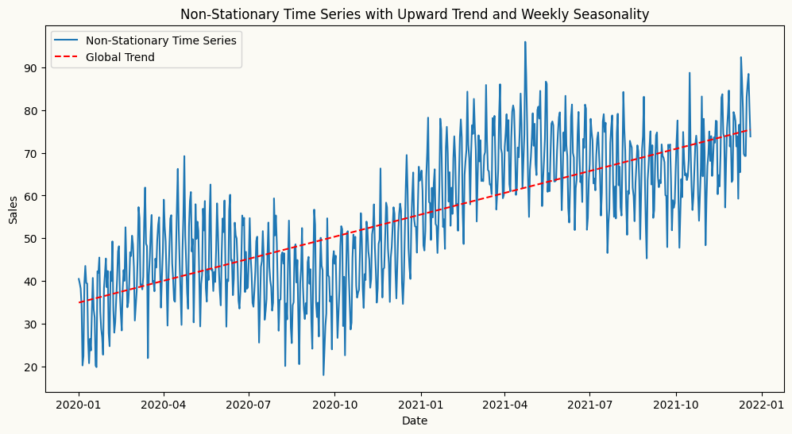

Here, we forecast the same series using multiple models — starting with
ETS, which handles non-stationary data natively, then ARIMA and ML
regressors, where peshbeen’s built-in detrending and transformation
pipeline takes care of stationarity automatically.

**ETS Example**

``` python
from lightgbm import LGBMRegressor
train = sales_data.iloc[:-30]
test = sales_data.iloc[-30:]
from peshbeen.models import ets, arima, ml_forecaster
ets_model = ets(target_col='sales', seasonal = 'additive', seasonal_periods=7)
ets_model.fit(train)
ets_forecast = ets_model.forecast(H=30)
# plot the forecast
plt.figure(figsize=(12, 6))
plt.plot(train.index[-120:], train['sales'][-120:], label='Train')
plt.plot(test.index, test['sales'], label='Test')
plt.plot(test.index, ets_forecast, label='ETS Forecast')
plt.title('ETS Forecast')
plt.xlabel('Date')
plt.ylabel('Sales')
plt.legend()
plt.show()
```

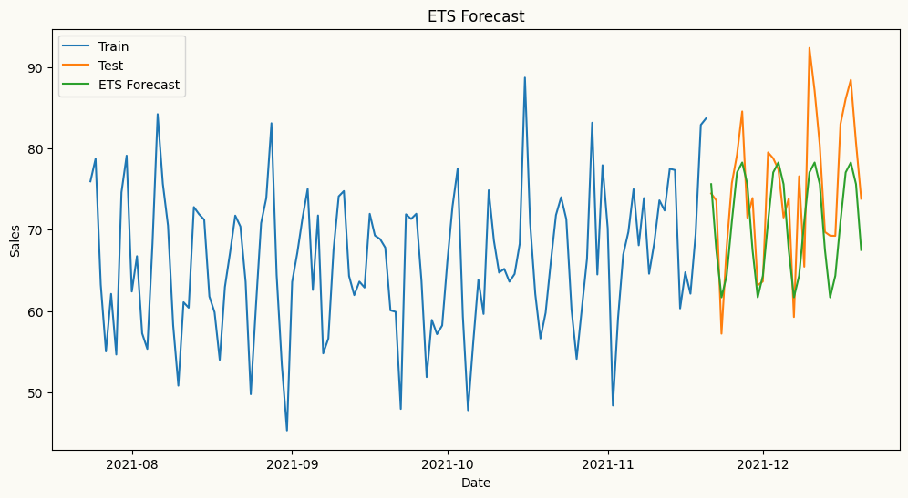

**ARIMA Example**

Arima automatically applies differencing to make the series stationary
by specifying the order of differencing (d) in the model parameters. In
this example, we set d=1 to apply first-order differencing, which helps
to remove the trend and make the series stationary for ARIMA modeling.
To guide lag selection, we can also visualize the ACF and PACF plots of
the original series to identify the ideal number of autoregressive (p)
and moving average (q) terms for the ARIMA model. The ACF plot helps to
identify the number of MA terms, while the PACF plot helps to identify
the number of AR terms. As shown in the plots below, the ACF plot
exhibits a slow decay, indicating non-stationarity, while the PACF plot
shows significant spikes at lags 1 and 2, suggesting that an AR(2) model
may be appropriate for the ARIMA model.

``` python
from statsmodels.graphics.tsaplots import plot_acf, plot_pacf

fig, axes = plt.subplots(2, 1, figsize=(10, 6))
plot_pacf(train["sales"], ax=axes[0], title="PACF")
plot_acf(train["sales"], ax=axes[1], title="ACF")
plt.show()
```

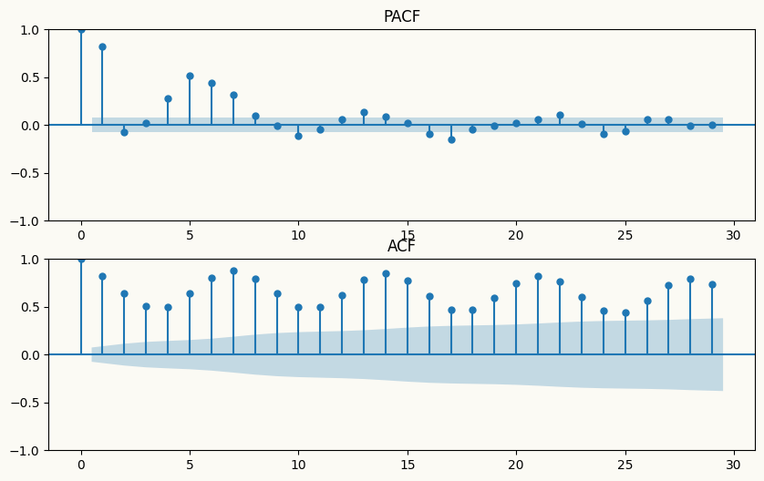

### Trend removal via differencing

Let’s see how the forecasts look when doesn’t apply differencing for
ARIMA and machine learning forecasters using LightGBMRegressor as
regressor.

``` python
# arima forecast
arima_model = arima(target_col='sales', order=(2,0,0), seasonal_order=(1,0,0), seasonal_length=7)
arima_model.fit(train)
arima_forecast = arima_model.forecast(H=30)

# ml forecast using lightgbm
lgb_model = ml_forecaster(target_col='sales',model=LGBMRegressor(verbose=-1, n_estimators=100, learning_rate=0.1),
                          lags=7)
lgb_model.fit(train)
lgb_forecast = lgb_model.forecast(H=30)

# plot the forecast
plt.figure(figsize=(12, 6))
plt.plot(train.index[-120:], train['sales'][-120:], label='Train')
plt.plot(test.index, test['sales'], label='Test')
plt.plot(test.index, arima_forecast, label='ARIMA Forecasts without differencing')
plt.plot(test.index, lgb_forecast, label='LightGBM Forecasts without differencing')
plt.title('ARIMA and LightGBM Forecasts')
plt.xlabel('Date')
plt.ylabel('Sales')
plt.legend()
plt.show()
```

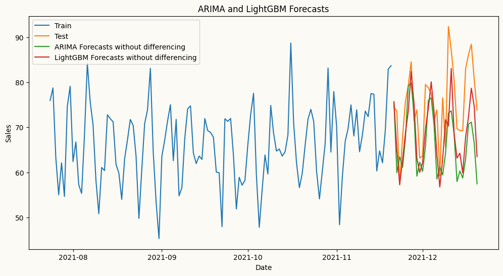

As shown in the plot above, particularly, forecasts from the ARIMA model
without differencing are underforecasting the upward trend in the data,
resulting in forecasts that are significantly lower than the actual
values. This highlights the importance of applying differencing to
achieve stationarity when using ARIMA models, as it allows the model to
capture the underlying patterns and trends in the data more effectively,
leading to more accurate forecasts. Now, let’s see how the forecasts
look when we apply differencing for ARIMA.

``` python
# arima forecast
arima_model = arima(target_col='sales', order=(2,1,0), seasonal_order=(1,0,0), seasonal_length=7)
arima_model.fit(train)
arima_forecast = arima_model.forecast(H=30)

# ml forecast using lightgbm
lgb_model = ml_forecaster(target_col='sales',model=LGBMRegressor(verbose=-1, n_estimators=100, learning_rate=0.1), lags=7, difference=1)
lgb_model.fit(train)
lgb_forecast = lgb_model.forecast(H=30)
# plot the forecast
plt.figure(figsize=(12, 6))
plt.plot(train.index[-120:], train['sales'][-120:], label='Train')
plt.plot(test.index, test['sales'], label='Test')
plt.plot(test.index, arima_forecast, label='ARIMA Forecast with differencing')
plt.plot(test.index, lgb_forecast, label='LightGBM Forecast with differencing')
plt.title('ARIMA and LightGBM Forecasts with Differencing')
plt.xlabel('Date')
plt.ylabel('Sales')
plt.legend()
plt.show()
```

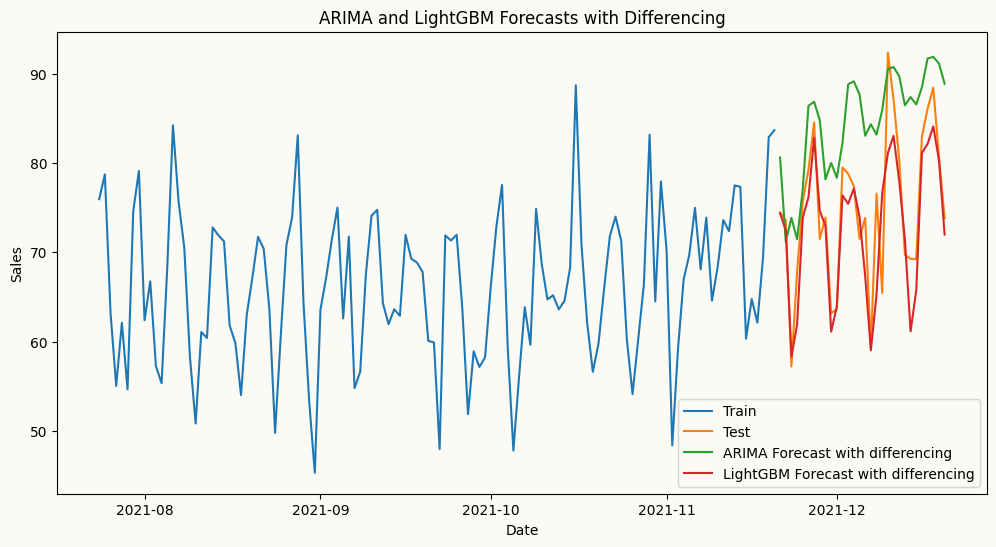

When differencing is applied to strongly trending data, results can vary
significantly across model families. LightGBM manages to track the trend
reasonably well, while ARIMA overshoots considerably — because
differencing removes the trend incrementally, and in the presence of a
strong deterministic trend, this can inflate the model’s variance and
cause it to fit noise rather than signal, leading to poor out-of-sample
performance.

This highlights an important practical consideration: differencing is
not always the right tool for non-stationarity. When the trend is strong
and smooth, more effective alternatives include detrending via linear
regression, or piecewise linear regression when structural breaks are
present. When the data also exhibits local seasonality or a time-varying
trend, a better approach is to first fit an ETS model to capture those
components, then apply ARIMA to the residuals.

### Trend removal via global detrending

Rather than differencing, we can detrend the series by fitting a linear
regression to the original time series, extracting the underlying trend,
and passing the residuals to ARIMA or ML regressors. This is a valid and
often more stable approach to achieving stationarity when the trend is
deterministic and approximately linear — the residuals are stationary by
construction, and the forecasting model focuses purely on the remaining
dynamics. peshbeen’s detrending pipeline handles this automatically.

``` python
# arima forecast with linear detrending
arima_model = arima(target_col='sales', order=(2,0,0), seasonal_order=(1,0,0), seasonal_length=7, trend='linear')
arima_model.fit(train)
arima_forecast = arima_model.forecast(H=30)

# ml forecast using lightgbm with linear detrending
lgb_model = ml_forecaster(target_col='sales',model=LGBMRegressor(verbose=-1, n_estimators=100, learning_rate=0.1), lags=7, trend='linear')
lgb_model.fit(train)
lgb_forecast = lgb_model.forecast(H=30)

# ml forecast using neural network with linear detrending
from sklearn.neural_network import MLPRegressor
nn_model = ml_forecaster(target_col='sales',model=MLPRegressor(hidden_layer_sizes=(128, 64, 32), activation='relu', solver='adam', max_iter=200), lags=7, trend='linear')
nn_model.fit(train)
nn_forecast = nn_model.forecast(H=30)

# plot the forecast
plt.figure(figsize=(12, 6))
plt.plot(train.index[-120:], train['sales'][-120:], label='Train')
plt.plot(test.index, test['sales'], label='Test')
plt.plot(test.index, arima_forecast, label='ARIMA Forecast')
plt.plot(test.index, lgb_forecast, label='LightGBM Forecast')
plt.plot(test.index, nn_forecast, label='Neural Network Forecast')
plt.title('ARIMA, LightGBM and Neural Network Forecasts with Trend')
plt.xlabel('Date')
plt.ylabel('Sales')
plt.legend()
plt.show()
```

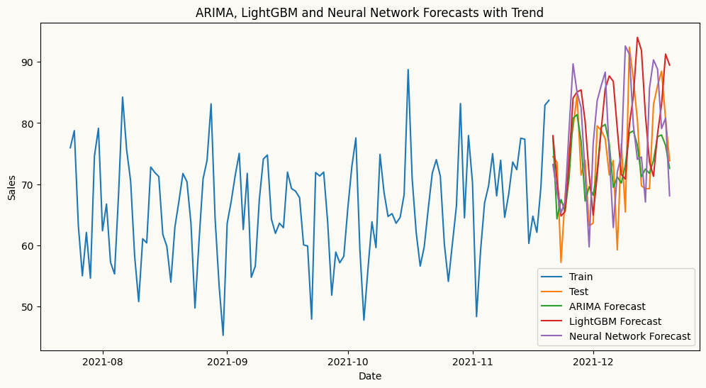

In the plot above, we can see that the forecasts from the ARIMA,
LightGBM and Neural Network models with detrending are much closer to
the actual values and more unbiased compared to the forecasts without
detrending. This demonstrates the effectiveness of detrending in
improving the accuracy of forecasts from ARIMA and machine learning
models when dealing with non-stationary time series data. By removing
the underlying trend, the models can better capture the true patterns in
the data, leading to more accurate and reliable forecasts.

### Trend removal via ETS (Error-Trend-Seasonality)

The trend may not always be linear, and the series may also exhibit a
time-varying trend. In such cases, a more effective approach is to first
fit an ETS model to capture the trend (or together with the seasonal
component), then apply ARIMA or ML regressors to the residuals. This
allows us to model the complex non-stationarity in the data more
effectively, as the ETS model can capture the evolving trend and
seasonal patterns, while the ARIMA or ML model focuses on modeling the
remaining stationary residuals. peshbeen’s pipeline automates this
process, ensuring that the forecasting models are applied to stationary
data for improved accuracy.

``` python
# We might need to use a more flexible trend model like ETS to capture the non-linear trend in the data. Let's fit an ETS model and plot the fitted values.
from statsmodels.tsa.holtwinters import ExponentialSmoothing
ets_model = ExponentialSmoothing(train['sales'], trend='add')
ets_model_fit = ets_model.fit(smoothing_level=0.05, smoothing_trend=0.001)
# plot the fitted values and the original series
plt.figure(figsize=(12, 6))
plt.plot(train.index, train['sales'], label='Original Series')
plt.plot(train.index, ets_model_fit.fittedvalues, label='Fitted Values', color='red', linestyle='-')
plt.title('ETS Model Fit')
plt.xlabel('Date')
plt.ylabel('Sales')
plt.legend()
plt.show()
```

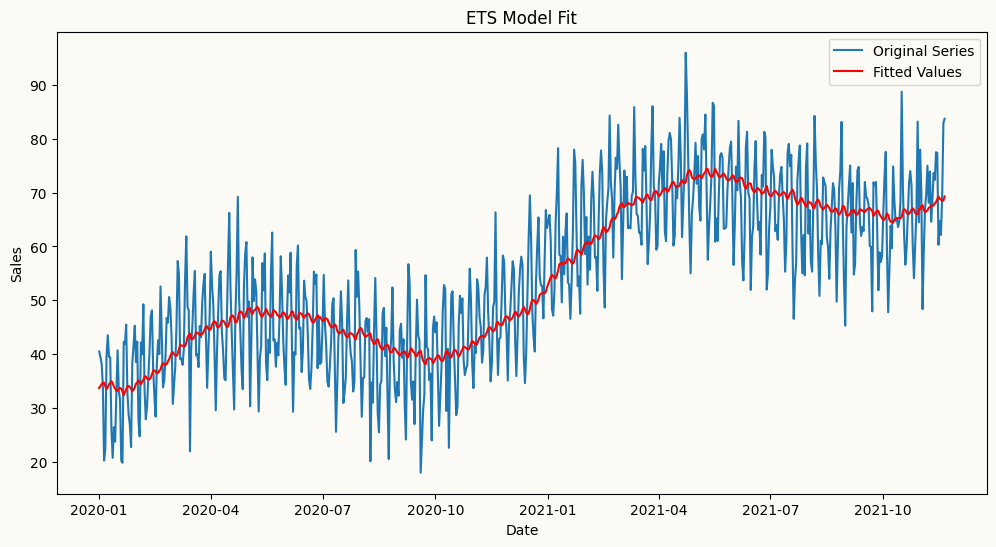

``` python
# arima forecast with ets detrending
arima_model = arima(target_col='sales', order=(2,0,0), seasonal_order=(1,0,0), seasonal_length=7,
                    trend='ets', ets_params={'trend': 'add','smoothing_level': 0.05, 'smoothing_trend': 0.001})
arima_model.fit(train)
arima_forecast = arima_model.forecast(H=30)

# ml forecast using lightgbm with ets detrending
lgb_model = ml_forecaster(target_col='sales',model=LGBMRegressor(verbose=-1, n_estimators=100,learning_rate=0.1),
                          lags=7, trend='ets', ets_params={'trend': 'add', 'smoothing_level': 0.05, 'smoothing_trend': 0.001})
lgb_model.fit(train)
lgb_forecast = lgb_model.forecast(H=30)

# plot the forecast
plt.figure(figsize=(12, 6))
plt.plot(train.index[-120:], train['sales'][-120:], label='Train')
plt.plot(test.index, test['sales'], label='Test')
plt.plot(test.index, arima_forecast, label='ARIMA Forecast')
plt.plot(test.index, lgb_forecast, label='LightGBM Forecast')
plt.title('ARIMA and LightGBM Forecasts with ETS Detrending')
plt.xlabel('Date')
plt.ylabel('Sales')
plt.legend()
plt.show()
```

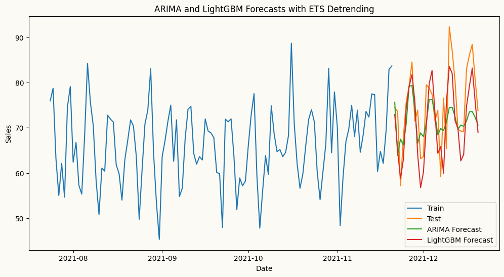

### Trend removal via Piecewise Linear Regression

Linear detrending assumes a single consistent trend across the entire
series — but what if the trend shifts at some point? In such cases,
piecewise linear regression is a more appropriate approach: given a
known breakpoint, it fits separate linear trends to each segment.
peshbeen’s detrending pipeline supports this automatically, allowing
both statistical and ML models to benefit from more accurate trend
removal in the presence of structural breaks.

``` python
# lets explore the noisy wales hospital admissions dataset to see how piecewise linear regression can help with structural breaks in the trend. The dataset contains daily hospital admissions in Wales, and we know there was a significant structural break in the trend around March 2020 due to the COVID-19 pandemic. We will load the dataset and visualize the trend to identify the breakpoint.
from peshbeen.datasets import load_wales_admissions
wales_admissions = load_wales_admissions()
wales_admissions["day_of_week"] = wales_admissions.index.dayofweek
wales_admissions["month"] = wales_admissions.index.month
cat_variables = ["day_of_week", "month"]
figure, ax = plt.subplots(figsize=(12,6))
wales_admissions["admissions"].plot(ax=ax)
ax.set_title("Daily Hospital Admissions in Wales")
ax.set_xlabel("Date")
ax.set_ylabel("Admissions")
plt.show()
```

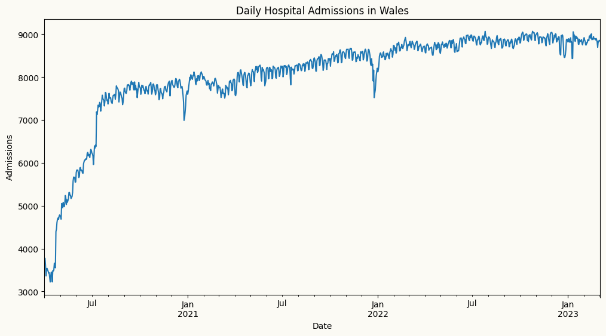

Let’s find the breakpoint using the pelt method from the `ruptures`
library and `radial basis function` cost function, which is good for
detecting changes in mean and variance.

``` python
import ruptures as rpt
admis_array = load_wales_admissions["admissions"].values
change_det = rpt.Pelt(model="rbf").fit(admis_array)
result_rbf = change_det.predict(60) # higher penalty means fewer breakpoints, recommend trying other values to see which one captures the break better visually.
rpt.display(admis_array, result_rbf, figsize=(12, 6))
plt.show()
```

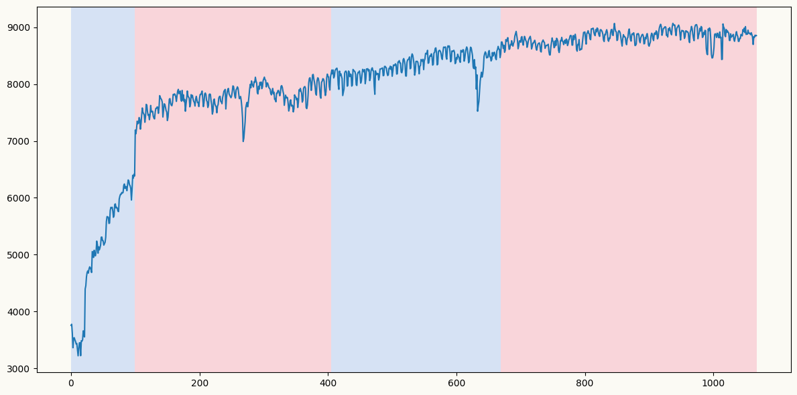

``` python
result_rbf # the detected breakpoints seem to be at indices 100 and 510 (the last one is at the end of the series, so we can ignore it)
```

    [100, 405, 670, 1068]

Although change point detection methods suugest 2 breakpoints, it seems
that the first one is more prevalent from the plot, which is around July
2020, when the relaxation of the first COVID-19 lockdown measures
started in UK. By specifying this breakpoint in peshbeen’s detrending
pipeline, we can fit separate linear trends before and after the
breakpoint, allowing for more accurate modeling of the underlying trend
in the presence of structural breaks. This approach helps to capture the
different dynamics in each segment of the series, leading to improved
forecasting performance for both statistical and machine learning
models.

First, we can visualize the original series along with the fitted
piecewise linear trend to confirm that the breakpoint is correctly
identified and that the piecewise linear regression captures the
underlying trend effectively.

``` python
from peshbeen.statstools import lr_trend_model, forecast_trend
ch_points = result_rbf[:-1] # ignore the last breakpoint at the end of the series
train_admit_trend = wales_admissions.iloc[:-60]
test_admit_trend = wales_admissions.iloc[-60:]
fitted_trend, pw_model, _ = lr_trend_model(train_admit_trend["admissions"], breakpoints=ch_points, type="piecewise")
trend_forecast, _ = forecast_trend(model=pw_model, H=60, breakpoints=ch_points, start=train_admit_trend.shape[0])

# plot the original series and the fitted piecewise linear trend
plt.figure(figsize=(12, 6))
plt.plot(wales_admissions.index, wales_admissions['admissions'], label='Original Series')
plt.plot(wales_admissions.index[:-60], fitted_trend, label='Fitted Piecewise Linear Trend', color='red', linestyle='-')
plt.plot(test_admit_trend.index, trend_forecast, label='Trend Forecast', color='green', linestyle='--')
plt.title('Piecewise Linear Trend Fit to Hospital Admissions')
plt.xlabel('Date')
plt.ylabel('Admissions')
plt.legend()
plt.show()
```

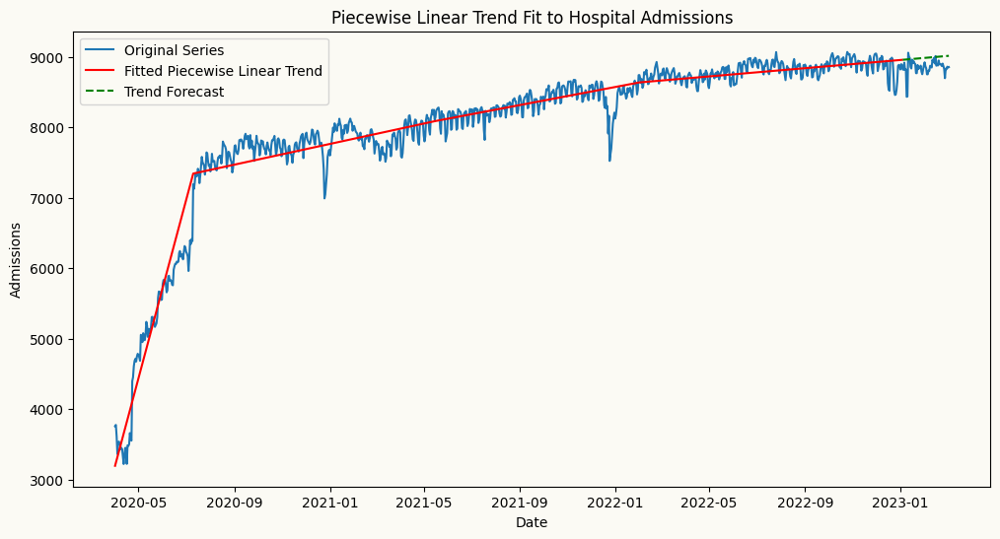

The plot above shows the original non-stationary time series with an
upward trend with breaks, along with the fitted piecewise linear trend
(in red) that captures the structural break around July 2020. This
visualization confirms that the piecewise linear regression is
effectively modeling the changing trend in the data, allowing for more
accurate detrending and improved forecasting performance for a model
such as LGBMRegressor that is applied to the detrended series.

``` python
from sklearn.preprocessing import OneHotEncoder
ohe = OneHotEncoder(drop='first', sparse_output=False, handle_unknown="ignore")

# forecasting model incorporating piecewise linear trend
pw_fmodel = ml_forecaster(model=LGBMRegressor(),
              target_col='admissions', lags = 7, cat_variables=cat_variables, trend="linear",
              change_points=ch_points) 
pw_fmodel.fit(train_admit_trend)
pw_forecasts = pw_fmodel.forecast(H=60, exog=test_admit_trend[cat_variables])

# forecasting model incorporating piecewise linear trend
lr_fmodel = ml_forecaster(model=LGBMRegressor(),
              target_col='admissions', lags = 7, cat_variables=cat_variables, trend="linear")
lr_fmodel.fit(train_admit_trend)
lr_forecasts = lr_fmodel.forecast(H=60, exog=test_admit_trend[cat_variables])


# Forecast using differencing to remove the trend
diff_fmodel = ml_forecaster(model=LGBMRegressor(),
              target_col='admissions', lags = 7, cat_variables=cat_variables, difference=1)
diff_fmodel.fit(train_admit_trend)
diff_forecasts = diff_fmodel.forecast(H=60, exog=test_admit_trend[cat_variables])

# plot the forecast and actuals
plt.figure(figsize=(12, 6))
plt.plot(train_admit_trend.index[-120:], train_admit_trend['admissions'][-120:], label='Train')
plt.plot(test_admit_trend.index, test_admit_trend['admissions'], label='Test')
plt.plot(test_admit_trend.index, pw_forecasts, label='LightGBM Forecast with Piecewise Linear Trend')
plt.plot(test_admit_trend.index, lr_forecasts, label='LightGBM Forecast with Linear Trend')
plt.plot(test_admit_trend.index, diff_forecasts, label='LightGBM Forecast with Differencing')
plt.title('LightGBM Forecast with Piecewise Linear Trend')
plt.xlabel('Date')
plt.ylabel('Admissions')
plt.legend()
plt.show()
```

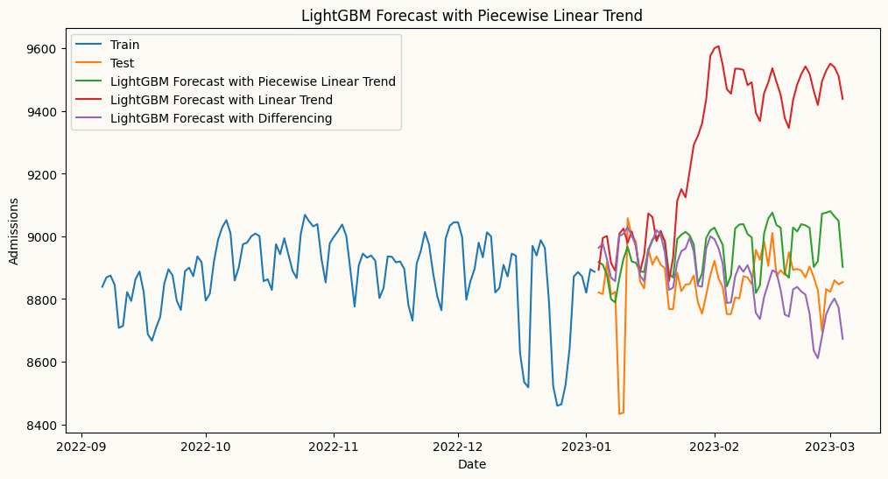

From the plot above, we can see that the piecewise linear regression
captures the future trend more accurately than both the global linear
trend and differencing. The piecewise linear trend (in green) closely
follows future values of the series, while the global linear trend (in
red) overestimates the future trend, and the differenced series (in
purple) underestimates it. This highlights the importance of using
piecewise linear regression for detrending when there are structural
breaks in the data, as it allows for more accurate modeling of the
underlying trend and improved forecasting performance.
