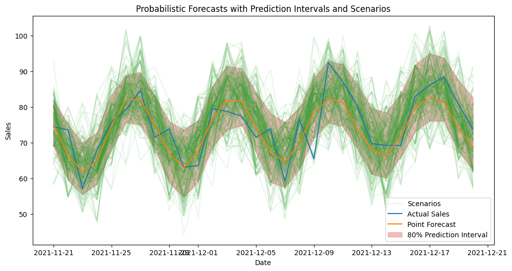

<!-- WARNING: THIS FILE WAS AUTOGENERATED! DO NOT EDIT! -->

## Probabilistic Forecasting

peshbeen provides native support for probabilistic forecasting, allowing
users to obtain not only point forecasts but also prediction intervals
and full forecast scenarios. For any model in the library, prediction
intervals are generated by calibrating the model’s residuals on a
held-out calibration set, then using those calibrated residuals to
simulate future paths of the series — giving a realistic picture of
forecast uncertainty rather than a single optimistic trajectory.
peshbeen supports four calibration methods: bootstrapping, correlated
error bootstrapping, KDE-based sampling, and conformal prediction. The
first three support both prediction intervals and scenario generation;
conformal prediction is limited to prediction intervals only.

``` python
import pandas as pd
import numpy as np
from peshbeen.transformations import fourier_terms
date_range = pd.date_range(start='2020-01-01', periods=720, freq='D')
# create a non-stationary arbitrary flower sales data with an upward trend, weekly seasonality, and yearly seasonality
np.random.seed(42)
data = 30 + 0.07 * np.arange(720) + 10 * np.sin(2 * np.pi * date_range.dayofyear / 7) + 10 * np.sin(2 * np.pi * date_range.dayofyear / 365) + np.random.normal(0, 5, 720)

sales_data = pd.DataFrame(data, index=date_range, columns=['sales'])
sales_data['day_of_week'] = sales_data.index.dayofweek

fourier_trms = fourier_terms(index=sales_data.index, period=365, num_terms=2)
sales_data = sales_data.merge(fourier_trms, left_index=True, right_index=True) # merge the fourier terms with the original data to be used as exogenous variables in the model

# split the data into train and test
train = sales_data.iloc[:-30]
test = sales_data.iloc[-30:] # drop the target column from the exogenous variables for the test set
cat_vars = ['day_of_week']

from peshbeen.models import ml_forecaster
from peshbeen.probabilistic_forecasting import prob_forecasts
from sklearn.linear_model import LinearRegression
from sklearn.preprocessing import OneHotEncoder
ohe = OneHotEncoder(drop='first', sparse_output=False, handle_unknown="ignore")

# lets use our sales_exog dataset to generate probabilistic forecasts using the linear regression model we fitted with fourier terms as exogenous variables. We will use the bootstrapping method to generate prediction intervals and forecast scenarios, which will allow us to capture the uncertainty in our forecasts and provide a range of possible future outcomes based on the variability in the historical data. This approach is particularly useful for decision-making and risk assessment, as it gives us insights into the potential variability in future sales rather than just a single point forecast. We will then visualize the prediction intervals and scenarios to better understand the uncertainty around our forecasts.
# first create a model instance with the same specifications as the one we used to generate point forecasts, but without fitting it yet
lr_model = ml_forecaster(model=LinearRegression(),
              target_col='sales', lags = 7, cat_variables=cat_vars, categorical_encoder=ohe)
lr_model.fit(train)
lr_forecast = lr_model.forecast(H=30, exog=test.drop(columns=['sales'])) # generate point forecasts for the test set using the fitted linear regression model with fourier terms as exogenous variables
prob_model = prob_forecasts(model=lr_model, H=30, n_calibration=150, step_size=1, random_state=42)
## Generate 1000 forecast scenarios using the KDE-based sampling method, which will allow us to capture the uncertainty in our forecasts and provide a range of possible future outcomes based on the variability in the historical data. We will use the exogenous variables from the test set to generate these scenarios, which will help us understand how different future paths of the series can evolve given the uncertainty in the data and the model.
prob_samples = prob_model.sample(df=train, n_samples=1000, method="empirical", future_exog=test.drop(columns=['sales'])) # empirical method, which generates forecast scenarios by sampling from the empirical distribution of the residuals, allowing us to capture the variability in the historical data and provide a range of possible future outcomes based on that distribution. By using the exogenous variables from the test set, we can also account for any future changes in those variables that may impact the forecasts, providing a more realistic picture of potential future scenarios.
# other options for method are "bootstrap" and "correlated_bootstrap" for both prediction intervals and scenarios, and "conformal" for prediction intervals only. Each method has its own assumptions and characteristics, so it's recommended to try different methods to see which one captures the uncertainty in the forecasts better for your specific dataset and use case.
# prob_samples = prob_model.sample(df=train_exog, n_samples=1000, method="empirical", future_exog=test_exog) # bootstrap method, which resamples the residuals with replacement to generate forecast scenarios, allowing us to capture the variability in the historical data and provide a range of possible future outcomes based on the empirical distribution of the residuals. This method is straightforward and does not make strong assumptions about the distribution of the residuals, making it a popular choice for generating probabilistic forecasts. By using the exogenous variables from the test set, we can also account for any future changes in those variables that may impact the forecasts, providing a more realistic picture of potential future scenarios.
# prob_samples = prob_model.sample(df=train_exog, n_samples=1000, method="correlated", future_exog=test_exog) # correlated error bootstrap method, which resamples the residuals while preserving their correlation structure to generate forecast scenarios, allowing us to capture the variability in the historical data and provide a range of possible future outcomes based on the empirical distribution of the residuals while also accounting for any correlation between them. This method is particularly useful when there is autocorrelation in the residuals, as it helps to maintain the temporal dependence structure in the generated scenarios. By using the exogenous variables from the test set, we can also account for any future changes in those variables that may impact the forecasts, providing a more realistic picture of potential future scenarios.
```

``` python
scenarios_df = prob_samples.sample_paths_df
scenarios_df.head()
```

<div>
<style scoped>
    .dataframe tbody tr th:only-of-type {
        vertical-align: middle;
    }
&#10;    .dataframe tbody tr th {
        vertical-align: top;
    }
&#10;    .dataframe thead th {
        text-align: right;
    }
</style>

<table class="dataframe" data-quarto-postprocess="true" data-border="1">
<thead>
<tr style="text-align: right;">
<th data-quarto-table-cell-role="th"></th>
<th data-quarto-table-cell-role="th">h_1</th>
<th data-quarto-table-cell-role="th">h_2</th>
<th data-quarto-table-cell-role="th">h_3</th>
<th data-quarto-table-cell-role="th">h_4</th>
<th data-quarto-table-cell-role="th">h_5</th>
<th data-quarto-table-cell-role="th">h_6</th>
<th data-quarto-table-cell-role="th">h_7</th>
<th data-quarto-table-cell-role="th">h_8</th>
<th data-quarto-table-cell-role="th">h_9</th>
<th data-quarto-table-cell-role="th">h_10</th>
<th data-quarto-table-cell-role="th">...</th>
<th data-quarto-table-cell-role="th">h_21</th>
<th data-quarto-table-cell-role="th">h_22</th>
<th data-quarto-table-cell-role="th">h_23</th>
<th data-quarto-table-cell-role="th">h_24</th>
<th data-quarto-table-cell-role="th">h_25</th>
<th data-quarto-table-cell-role="th">h_26</th>
<th data-quarto-table-cell-role="th">h_27</th>
<th data-quarto-table-cell-role="th">h_28</th>
<th data-quarto-table-cell-role="th">h_29</th>
<th data-quarto-table-cell-role="th">h_30</th>
</tr>
</thead>
<tbody>
<tr>
<td data-quarto-table-cell-role="th">0</td>
<td>70.203125</td>
<td>68.211784</td>
<td>61.222973</td>
<td>47.457646</td>
<td>81.232649</td>
<td>77.495237</td>
<td>87.476730</td>
<td>71.192629</td>
<td>67.034386</td>
<td>60.305736</td>
<td>...</td>
<td>85.838524</td>
<td>75.784002</td>
<td>69.753410</td>
<td>69.731598</td>
<td>72.669514</td>
<td>79.870773</td>
<td>93.659278</td>
<td>88.009088</td>
<td>87.464328</td>
<td>74.435822</td>
</tr>
<tr>
<td data-quarto-table-cell-role="th">1</td>
<td>78.691134</td>
<td>74.740641</td>
<td>61.016970</td>
<td>83.559826</td>
<td>90.572751</td>
<td>87.953672</td>
<td>96.814063</td>
<td>79.939854</td>
<td>64.572440</td>
<td>68.788660</td>
<td>...</td>
<td>74.970377</td>
<td>72.838277</td>
<td>68.561255</td>
<td>64.933742</td>
<td>77.445978</td>
<td>67.482043</td>
<td>91.776537</td>
<td>91.707965</td>
<td>76.203132</td>
<td>75.481506</td>
</tr>
<tr>
<td data-quarto-table-cell-role="th">2</td>
<td>82.069878</td>
<td>61.770775</td>
<td>67.900598</td>
<td>67.495120</td>
<td>69.749580</td>
<td>79.239796</td>
<td>79.836127</td>
<td>66.879103</td>
<td>66.755009</td>
<td>66.691565</td>
<td>...</td>
<td>87.017650</td>
<td>64.417982</td>
<td>75.878479</td>
<td>80.253700</td>
<td>79.177897</td>
<td>83.927480</td>
<td>84.239859</td>
<td>69.757712</td>
<td>78.160331</td>
<td>66.422037</td>
</tr>
<tr>
<td data-quarto-table-cell-role="th">3</td>
<td>80.346174</td>
<td>66.091816</td>
<td>61.401799</td>
<td>62.789824</td>
<td>72.857167</td>
<td>83.558991</td>
<td>80.061408</td>
<td>81.668895</td>
<td>72.644718</td>
<td>67.219090</td>
<td>...</td>
<td>76.933844</td>
<td>69.719599</td>
<td>61.166186</td>
<td>64.933742</td>
<td>68.640012</td>
<td>87.175191</td>
<td>81.238305</td>
<td>91.028212</td>
<td>69.380568</td>
<td>75.335512</td>
</tr>
<tr>
<td data-quarto-table-cell-role="th">4</td>
<td>66.752091</td>
<td>64.230679</td>
<td>62.686489</td>
<td>67.053262</td>
<td>67.114281</td>
<td>83.131232</td>
<td>77.014338</td>
<td>61.557219</td>
<td>69.843805</td>
<td>53.361732</td>
<td>...</td>
<td>78.910478</td>
<td>70.907761</td>
<td>81.000763</td>
<td>74.934948</td>
<td>66.045678</td>
<td>90.214074</td>
<td>83.649049</td>
<td>88.001431</td>
<td>85.495248</td>
<td>72.394421</td>
</tr>
</tbody>
</table>

<p>5 rows × 30 columns</p>
</div>

``` python
# we can also generate prediction intervals from the generated scenarios using the sample_quantiles attribute of the prob_samples object, which gives us the quantiles of the simulated forecast paths and allows us to visualize the uncertainty around our forecasts in the form of prediction intervals.
prediction_intervals = prob_samples.sample_quantiles(quantiles=[0.1, 0.9])
prediction_intervals.head()
```

<div>
<style scoped>
    .dataframe tbody tr th:only-of-type {
        vertical-align: middle;
    }
&#10;    .dataframe tbody tr th {
        vertical-align: top;
    }
&#10;    .dataframe thead th {
        text-align: right;
    }
</style>

<table class="dataframe" data-quarto-postprocess="true" data-border="1">
<thead>
<tr style="text-align: right;">
<th data-quarto-table-cell-role="th"></th>
<th data-quarto-table-cell-role="th">point_forecast</th>
<th data-quarto-table-cell-role="th">q_10</th>
<th data-quarto-table-cell-role="th">q_90</th>
</tr>
</thead>
<tbody>
<tr>
<td data-quarto-table-cell-role="th">0</td>
<td>75.106952</td>
<td>69.030466</td>
<td>81.959195</td>
</tr>
<tr>
<td data-quarto-table-cell-role="th">1</td>
<td>66.339791</td>
<td>59.629132</td>
<td>75.143235</td>
</tr>
<tr>
<td data-quarto-table-cell-role="th">2</td>
<td>62.027001</td>
<td>55.553265</td>
<td>69.990028</td>
</tr>
<tr>
<td data-quarto-table-cell-role="th">3</td>
<td>64.862720</td>
<td>58.447102</td>
<td>72.892975</td>
</tr>
<tr>
<td data-quarto-table-cell-role="th">4</td>
<td>74.599564</td>
<td>68.215537</td>
<td>83.387642</td>
</tr>
</tbody>
</table>

</div>

``` python
# lets visualize the prediction intervals and 15 scenarios from the generated probabilistic forecasts to understand the uncertainty around our forecasts and the range of possible future outcomes based on the variability in the historical data. This visualization will help us see how the forecasted values can vary and provide insights into potential risks and opportunities for decision-making.
import matplotlib.pyplot as plt
plt.figure(figsize=(12, 6))
# plot 201 scenarios
for i in range(200):
    plt.plot(test.index, scenarios_df.iloc[i], color='C2', alpha=0.1)
plt.plot(test.index, scenarios_df.iloc[100], color='C2', alpha=0.1, label='Scenarios') # added for labeling the scenarios in the legend
plt.plot(test.index, test['sales'], label='Actual Sales', color='C0')
plt.plot(test.index, lr_forecast, label='Point Forecast', color='C1')
# plot the prediction intervals we generated from the scenarios
plt.fill_between(test.index, prediction_intervals["q_10"], prediction_intervals["q_90"], color='C3', alpha=0.3, label='80% Prediction Interval')
plt.title('Probabilistic Forecasts with Prediction Intervals and Scenarios')
plt.xlabel('Date')
plt.ylabel('Sales')
plt.legend()
plt.show()
```



One concern with bootstrapping residuals is that it assumes the
residuals are independent and identically distributed (i.i.d.), which
may not hold in time series data where residuals can exhibit
autocorrelation. To address this, peshbeen offers correlated error
bootstrapping, which preserves the temporal dependence structure of the
residuals by resampling blocks of consecutive residuals rather than
individual residuals. This method may provide more accurate prediction
intervals and scenarios when there is significant autocorrelation in the
residuals.

Also, KDE-based sampling allows for a non-parametric estimation of the
residual distribution, which can capture more complex patterns in the
residuals compared to simple bootstrapping. This can lead to more
accurate and realistic forecast scenarios, especially when the residuals
exhibit non-normality or heteroscedasticity.

To obtain probabilistic forecasts via correlated error bootstrapping and
KDE-based sampling, user can simply pass `method="correlated"` or
`method="kde"` to the `sample` method of the
[`prob_forecasts`](https://mustafaslanCoto.github.io/peshbeen/modules/prob_forecast.html#prob_forecasts)
object, along with the training and future exogenous variables if
applicable.

### Conformal Prediction

Conformal prediction is a powerful technique for generating valid
prediction intervals without making strong assumptions about the
underlying data distribution. This method is particularly useful when
the residuals do not follow a normal distribution or when there is
heteroscedasticity in the data, as it provides robust and reliable
prediction intervals based on the empirical distribution of the
residuals. As conformal prediction does not rely on bootstrapping or
density estimation, it does not support scenario generation, but it can
be a valuable tool for obtaining accurate prediction intervals.

We can call `.conformal_quantiles` after `sample` to obtain conformal
prediction intervals for the desired quantiles, which will be based on
the empirical distribution of the residuals from the calibration set.
But since conformal prediction does not support scenario generation, we
do not need to first call `sample`. Instead, we can first calibrate the
model using the `calibrate` method, which will compute the residuals on
the calibration set and store them for later use in conformal
prediction. Then, we can call `.conformal_quantiles` directly to obtain
the prediction intervals for the specified quantiles, without needing to
generate forecast scenarios.

``` python
from xgboost import XGBRegressor
xgb_model = ml_forecaster(model=XGBRegressor(n_estimators=100, max_depth=5, random_state=42),
              target_col='sales', lags = 7, box_cox=0.5)
# xgb_model.fit(train_exog)
prob_model = prob_forecasts(model=xgb_model, H=30, n_calibration=150, step_size=1, random_state=42)
# 
prob_model.calibrate(df=train)
conformal_predictions = prob_model.conformal_quantiles(df=train, quantiles=[0.1, 0.9], future_exog=test.drop(columns=['sales']))
conformal_predictions.head()
```

<div>
<style scoped>
    .dataframe tbody tr th:only-of-type {
        vertical-align: middle;
    }
&#10;    .dataframe tbody tr th {
        vertical-align: top;
    }
&#10;    .dataframe thead th {
        text-align: right;
    }
</style>

<table class="dataframe" data-quarto-postprocess="true" data-border="1">
<thead>
<tr style="text-align: right;">
<th data-quarto-table-cell-role="th"></th>
<th data-quarto-table-cell-role="th">point_forecast</th>
<th data-quarto-table-cell-role="th">q_10</th>
<th data-quarto-table-cell-role="th">q_90</th>
</tr>
</thead>
<tbody>
<tr>
<td data-quarto-table-cell-role="th">0</td>
<td>74.912277</td>
<td>66.090329</td>
<td>83.734225</td>
</tr>
<tr>
<td data-quarto-table-cell-role="th">1</td>
<td>66.425034</td>
<td>57.871811</td>
<td>74.978256</td>
</tr>
<tr>
<td data-quarto-table-cell-role="th">2</td>
<td>54.184700</td>
<td>45.567349</td>
<td>62.802051</td>
</tr>
<tr>
<td data-quarto-table-cell-role="th">3</td>
<td>60.703491</td>
<td>51.632639</td>
<td>69.774344</td>
</tr>
<tr>
<td data-quarto-table-cell-role="th">4</td>
<td>65.144173</td>
<td>56.466028</td>
<td>73.822317</td>
</tr>
</tbody>
</table>

</div>

> What if there isn’t enough data to set aside a separate calibration
> set? In that case, in-sample residuals can be used instead — but with
> an important caveat: since the model is evaluated on the data it was
> trained on, the resulting prediction intervals will likely be
> optimistic, underestimating true forecast uncertainty. This is
> particularly true when the model overfits, as in-sample residuals will
> not fully reflect the variability the model will encounter on unseen
> data. That said, it is a practical and computationally efficient
> option when data is limited, as it avoids holding out any observations
> from training.

> Note that correlated error bootstrapping is not available for
> in-sample residuals, as its procedure relies on horizon-dependent
> error structure that cannot be derived from in-sample fit alone.

``` python
from sklearn.linear_model import Lasso
lr_model = ml_forecaster(model=Lasso(alpha=0.1, random_state=42),
              target_col='sales', lags = 21, box_cox=0.5)
prob_model_insample = prob_forecasts(model=lr_model, H=30, n_calibration=None, random_state=42) # Just leave n_calibration as None to use the training data for calibration
prob_samples = prob_model_insample.sample(df=train, n_samples=1000, method="kde", future_exog=test.drop(columns=['sales'])) # generate in-sample forecast scenarios using the KDE-based sampling method, which will allow us to capture the uncertainty in our forecasts and provide a range of possible future outcomes based on the variability in the historical data. By using the exogenous variables from the test set, we can also account for any future changes in those variables that may impact the forecasts, providing a more realistic picture of potential future scenarios.

prob_samples.sample_quantiles(quantiles=[0.1, 0.9]).head()
```

<div>
<style scoped>
    .dataframe tbody tr th:only-of-type {
        vertical-align: middle;
    }
&#10;    .dataframe tbody tr th {
        vertical-align: top;
    }
&#10;    .dataframe thead th {
        text-align: right;
    }
</style>

<table class="dataframe" data-quarto-postprocess="true" data-border="1">
<thead>
<tr style="text-align: right;">
<th data-quarto-table-cell-role="th"></th>
<th data-quarto-table-cell-role="th">point_forecast</th>
<th data-quarto-table-cell-role="th">q_10</th>
<th data-quarto-table-cell-role="th">q_90</th>
</tr>
</thead>
<tbody>
<tr>
<td data-quarto-table-cell-role="th">0</td>
<td>73.441562</td>
<td>64.805654</td>
<td>80.478289</td>
</tr>
<tr>
<td data-quarto-table-cell-role="th">1</td>
<td>67.889286</td>
<td>59.253379</td>
<td>74.926013</td>
</tr>
<tr>
<td data-quarto-table-cell-role="th">2</td>
<td>63.400497</td>
<td>54.764589</td>
<td>70.437224</td>
</tr>
<tr>
<td data-quarto-table-cell-role="th">3</td>
<td>65.285133</td>
<td>56.649225</td>
<td>72.321860</td>
</tr>
<tr>
<td data-quarto-table-cell-role="th">4</td>
<td>71.037142</td>
<td>62.401234</td>
<td>78.073869</td>
</tr>
</tbody>
</table>

</div>
