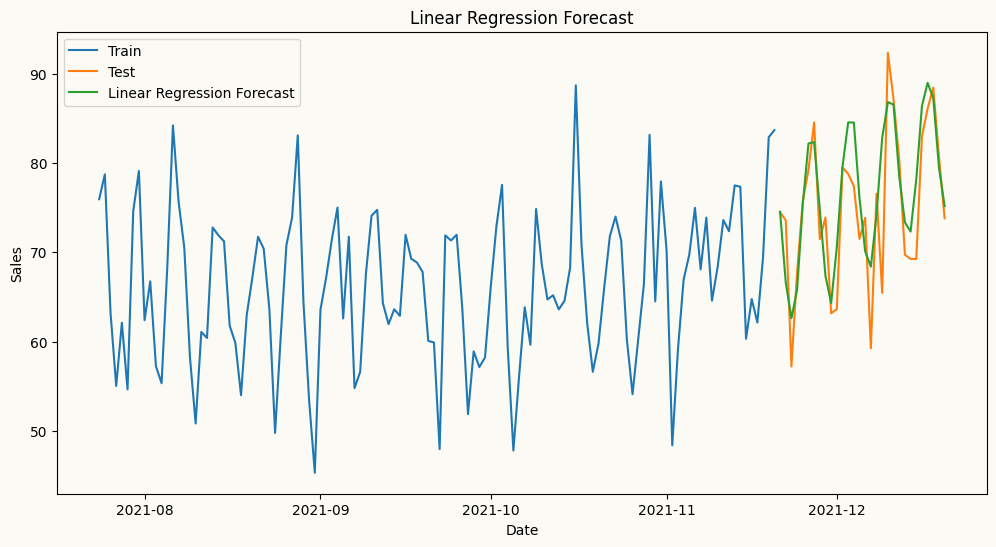
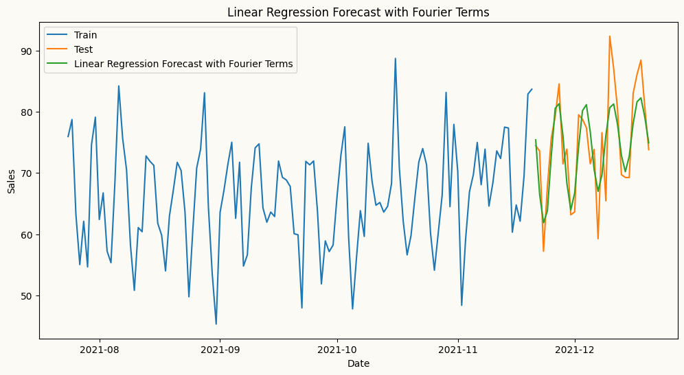

To encode calendar features as categorical variables, we can use any suitable encoding method from the `sklearn.preprocessing` module, such as `OneHotEncoder`, `TargetEncoder`, or `OrdinalEncoder`.

In three examples, we will use `OneHotEncoder` to encode the categorical variables in our dataset. This method creates new binary columns for each category in the original variable.


::: {#9bd70a33 .cell}
``` {.python .cell-code}

from sklearn.preprocessing import OneHotEncoder
import numpy as np
import pandas as pd
from peshbeen.models import ml_forecaster
from lightgbm import LGBMRegressor
from xgboost import XGBRegressor

date_range = pd.date_range(start='2020-01-01', periods=720, freq='D')
# create a non-stationary arbitrary flower sales data with an upward trend, weekly seasonality, and yearly seasonality
np.random.seed(42)
data = 30 + 0.07 * np.arange(720) + 10 * np.sin(2 * np.pi * date_range.dayofyear / 7) + 10 * np.sin(2 * np.pi * date_range.dayofyear / 365) + np.random.normal(0, 5, 720)

sales_data = pd.DataFrame(data, index=date_range, columns=['sales'])
sales_data["week_day"] = sales_data.index.dayofweek
sales_data["month"] = sales_data.index.month
cat_vars = ["week_day", "month"]
train = sales_data.iloc[:-30]
test = sales_data.iloc[-30:]

# Example of using OneHotEncoder for XGBoost
ohe = OneHotEncoder(sparse_output=False, handle_unknown="ignore", drop="first")

xgb = ml_forecaster(target_col="sales", model=XGBRegressor(n_estimators=100, random_state=42),
                    lags = 6,
                    cat_variables=cat_vars, categorical_encoder=ohe)
xgb.fit(train)
xgb_forecasts = xgb.forecast(30, exog=test[cat_vars])
```
:::


::: {#4a17c546 .cell}
``` {.python .cell-code}
# How the transformed features look like for XGBoost
xgb.X.head()
```

::: {.cell-output .cell-output-display}
```{=html}
<div>
<style scoped>
    .dataframe tbody tr th:only-of-type {
        vertical-align: middle;
    }

    .dataframe tbody tr th {
        vertical-align: top;
    }

    .dataframe thead th {
        text-align: right;
    }
</style>
<table border="1" class="dataframe">
  <thead>
    <tr style="text-align: right;">
      <th></th>
      <th>week_day_1</th>
      <th>week_day_2</th>
      <th>week_day_3</th>
      <th>week_day_4</th>
      <th>week_day_5</th>
      <th>week_day_6</th>
      <th>month_2</th>
      <th>month_3</th>
      <th>month_4</th>
      <th>month_5</th>
      <th>...</th>
      <th>month_9</th>
      <th>month_10</th>
      <th>month_11</th>
      <th>month_12</th>
      <th>sales_lag_1</th>
      <th>sales_lag_2</th>
      <th>sales_lag_3</th>
      <th>sales_lag_4</th>
      <th>sales_lag_5</th>
      <th>sales_lag_6</th>
    </tr>
  </thead>
  <tbody>
    <tr>
      <th>2020-01-07</th>
      <td>1.0</td>
      <td>0.0</td>
      <td>0.0</td>
      <td>0.0</td>
      <td>0.0</td>
      <td>0.0</td>
      <td>0.0</td>
      <td>0.0</td>
      <td>0.0</td>
      <td>0.0</td>
      <td>...</td>
      <td>0.0</td>
      <td>0.0</td>
      <td>0.0</td>
      <td>0.0</td>
      <td>22.392017</td>
      <td>20.219602</td>
      <td>34.174336</td>
      <td>38.233477</td>
      <td>39.472174</td>
      <td>40.474019</td>
    </tr>
    <tr>
      <th>2020-01-08</th>
      <td>0.0</td>
      <td>1.0</td>
      <td>0.0</td>
      <td>0.0</td>
      <td>0.0</td>
      <td>0.0</td>
      <td>0.0</td>
      <td>0.0</td>
      <td>0.0</td>
      <td>0.0</td>
      <td>...</td>
      <td>0.0</td>
      <td>0.0</td>
      <td>0.0</td>
      <td>0.0</td>
      <td>39.518145</td>
      <td>22.392017</td>
      <td>20.219602</td>
      <td>34.174336</td>
      <td>38.233477</td>
      <td>39.472174</td>
    </tr>
    <tr>
      <th>2020-01-09</th>
      <td>0.0</td>
      <td>0.0</td>
      <td>1.0</td>
      <td>0.0</td>
      <td>0.0</td>
      <td>0.0</td>
      <td>0.0</td>
      <td>0.0</td>
      <td>0.0</td>
      <td>0.0</td>
      <td>...</td>
      <td>0.0</td>
      <td>0.0</td>
      <td>0.0</td>
      <td>0.0</td>
      <td>43.518276</td>
      <td>39.518145</td>
      <td>22.392017</td>
      <td>20.219602</td>
      <td>34.174336</td>
      <td>38.233477</td>
    </tr>
    <tr>
      <th>2020-01-10</th>
      <td>0.0</td>
      <td>0.0</td>
      <td>0.0</td>
      <td>1.0</td>
      <td>0.0</td>
      <td>0.0</td>
      <td>0.0</td>
      <td>0.0</td>
      <td>0.0</td>
      <td>0.0</td>
      <td>...</td>
      <td>0.0</td>
      <td>0.0</td>
      <td>0.0</td>
      <td>0.0</td>
      <td>39.504995</td>
      <td>43.518276</td>
      <td>39.518145</td>
      <td>22.392017</td>
      <td>20.219602</td>
      <td>34.174336</td>
    </tr>
    <tr>
      <th>2020-01-11</th>
      <td>0.0</td>
      <td>0.0</td>
      <td>0.0</td>
      <td>0.0</td>
      <td>1.0</td>
      <td>0.0</td>
      <td>0.0</td>
      <td>0.0</td>
      <td>0.0</td>
      <td>0.0</td>
      <td>...</td>
      <td>0.0</td>
      <td>0.0</td>
      <td>0.0</td>
      <td>0.0</td>
      <td>39.394569</td>
      <td>39.504995</td>
      <td>43.518276</td>
      <td>39.518145</td>
      <td>22.392017</td>
      <td>20.219602</td>
    </tr>
  </tbody>
</table>
<p>5 rows × 23 columns</p>
</div>
```
:::
:::


::: {#0f363606 .cell}
``` {.python .cell-code}
## Example of using TargetEncoder for LightGBM
from sklearn.preprocessing import TargetEncoder
te = TargetEncoder(cv=5)
lgb = ml_forecaster(target_col="sales", model=LGBMRegressor(n_estimators=100, random_state=42, verbose=-1),
                    lags = 6,
                    cat_variables=cat_vars, categorical_encoder=te)
lgb.fit(train)
lgb_forecasts = lgb.forecast(30, exog=test[cat_vars])
```
:::


::: {#750a7159 .cell}
``` {.python .cell-code}
# How the transformed features look like for LightGBM
lgb.X.head()
```

::: {.cell-output .cell-output-display}
```{=html}
<div>
<style scoped>
    .dataframe tbody tr th:only-of-type {
        vertical-align: middle;
    }

    .dataframe tbody tr th {
        vertical-align: top;
    }

    .dataframe thead th {
        text-align: right;
    }
</style>
<table border="1" class="dataframe">
  <thead>
    <tr style="text-align: right;">
      <th></th>
      <th>week_day</th>
      <th>month</th>
      <th>sales_lag_1</th>
      <th>sales_lag_2</th>
      <th>sales_lag_3</th>
      <th>sales_lag_4</th>
      <th>sales_lag_5</th>
      <th>sales_lag_6</th>
    </tr>
  </thead>
  <tbody>
    <tr>
      <th>2020-01-07</th>
      <td>50.118039</td>
      <td>46.945004</td>
      <td>22.392017</td>
      <td>20.219602</td>
      <td>34.174336</td>
      <td>38.233477</td>
      <td>39.472174</td>
      <td>40.474019</td>
    </tr>
    <tr>
      <th>2020-01-08</th>
      <td>55.195593</td>
      <td>47.235865</td>
      <td>39.518145</td>
      <td>22.392017</td>
      <td>20.219602</td>
      <td>34.174336</td>
      <td>38.233477</td>
      <td>39.472174</td>
    </tr>
    <tr>
      <th>2020-01-09</th>
      <td>59.591927</td>
      <td>46.210753</td>
      <td>43.518276</td>
      <td>39.518145</td>
      <td>22.392017</td>
      <td>20.219602</td>
      <td>34.174336</td>
      <td>38.233477</td>
    </tr>
    <tr>
      <th>2020-01-10</th>
      <td>59.436795</td>
      <td>46.478067</td>
      <td>39.504995</td>
      <td>43.518276</td>
      <td>39.518145</td>
      <td>22.392017</td>
      <td>20.219602</td>
      <td>34.174336</td>
    </tr>
    <tr>
      <th>2020-01-11</th>
      <td>57.761881</td>
      <td>49.035528</td>
      <td>39.394569</td>
      <td>39.504995</td>
      <td>43.518276</td>
      <td>39.518145</td>
      <td>22.392017</td>
      <td>20.219602</td>
    </tr>
  </tbody>
</table>
</div>
```
:::
:::


## Automatic Transformations for Rolling Window Features

peshbeen supports user-specified rolling window features — such as rolling means and standard deviations — which can be particularly useful for ML regressors as they capture recent dynamics in the series. Beyond feature engineering, peshbeen can automatically apply a Box-Cox transformation to the target variable when the data exhibits heteroscedasticity, stabilising variance before model fitting and improving forecast reliability.

::: {#a8e028be .cell 0='h' 1='i' 2='d' 3='e'}
``` {.python .cell-code}
import matplotlib.pyplot as plt
plt.rcParams['figure.facecolor'] = "#FBFAF4"
plt.rcParams['axes.facecolor'] = "#FBFAF4"

# dont show warnings
import warnings
warnings.filterwarnings("ignore")
```
:::


::: {#8e156961 .cell}
``` {.python .cell-code}
import matplotlib.pyplot as plt
from peshbeen.transformations import rolling_mean, rolling_quantile, rolling_std, expanding_mean
from peshbeen.models import ml_forecaster
from sklearn.linear_model import LinearRegression

transformations = [rolling_std(window_size=30, shift=1), rolling_mean(window_size=30, shift=7),
                   rolling_quantile(window_size=30, shift=1, quantile=0.25),
                   rolling_quantile(window_size=30, shift=1, quantile=0.75), expanding_mean(shift=1)]
linear_model = ml_forecaster(model=LinearRegression(),
              target_col='sales', lags = 7, box_cox=0.5,
              lag_transform=transformations, cat_variables=cat_vars, categorical_encoder=ohe)
linear_model.fit(train)
# linear_model.data_prep(train)
forecasts = linear_model.forecast(H=30, exog=test[cat_vars])

# plot the forecast and the actual values
plt.figure(figsize=(12, 6))
plt.plot(train.index[-120:], train['sales'][-120:], label='Train')
plt.plot(test.index, test['sales'], label='Test')
plt.plot(test.index, forecasts, label='Linear Regression Forecast')
plt.title('Linear Regression Forecast')
plt.xlabel('Date')
plt.ylabel('Sales')
plt.legend()
plt.show()
```

::: {.cell-output .cell-output-display}
{}
:::
:::


::: {#979f7eb1 .cell}
``` {.python .cell-code}
# How the transformed features look like for Linear Regression
linear_model.X.head()
```

::: {.cell-output .cell-output-display}
```{=html}
<div>
<style scoped>
    .dataframe tbody tr th:only-of-type {
        vertical-align: middle;
    }

    .dataframe tbody tr th {
        vertical-align: top;
    }

    .dataframe thead th {
        text-align: right;
    }
</style>
<table border="1" class="dataframe">
  <thead>
    <tr style="text-align: right;">
      <th></th>
      <th>week_day_1</th>
      <th>week_day_2</th>
      <th>week_day_3</th>
      <th>week_day_4</th>
      <th>week_day_5</th>
      <th>week_day_6</th>
      <th>month_2</th>
      <th>month_3</th>
      <th>month_4</th>
      <th>month_5</th>
      <th>...</th>
      <th>sales_lag_3</th>
      <th>sales_lag_4</th>
      <th>sales_lag_5</th>
      <th>sales_lag_6</th>
      <th>sales_lag_7</th>
      <th>rolling_std_30_shift_1</th>
      <th>rolling_mean_30_shift_7</th>
      <th>rolling_quantile_30_shift_1_q0.25</th>
      <th>rolling_quantile_30_shift_1_q0.75</th>
      <th>expanding_mean_shift_1</th>
    </tr>
  </thead>
  <tbody>
    <tr>
      <th>2020-01-08</th>
      <td>0.0</td>
      <td>1.0</td>
      <td>0.0</td>
      <td>0.0</td>
      <td>0.0</td>
      <td>0.0</td>
      <td>0.0</td>
      <td>0.0</td>
      <td>0.0</td>
      <td>0.0</td>
      <td>...</td>
      <td>6.993242</td>
      <td>9.691764</td>
      <td>10.366645</td>
      <td>10.565377</td>
      <td>10.723839</td>
      <td>1.581041</td>
      <td>10.723839</td>
      <td>8.577902</td>
      <td>10.569034</td>
      <td>9.482514</td>
    </tr>
    <tr>
      <th>2020-01-09</th>
      <td>0.0</td>
      <td>0.0</td>
      <td>1.0</td>
      <td>0.0</td>
      <td>0.0</td>
      <td>0.0</td>
      <td>0.0</td>
      <td>0.0</td>
      <td>0.0</td>
      <td>0.0</td>
      <td>...</td>
      <td>7.464041</td>
      <td>6.993242</td>
      <td>9.691764</td>
      <td>10.366645</td>
      <td>10.565377</td>
      <td>1.583857</td>
      <td>10.644608</td>
      <td>9.134833</td>
      <td>10.610479</td>
      <td>9.696410</td>
    </tr>
    <tr>
      <th>2020-01-10</th>
      <td>0.0</td>
      <td>0.0</td>
      <td>0.0</td>
      <td>1.0</td>
      <td>0.0</td>
      <td>0.0</td>
      <td>0.0</td>
      <td>0.0</td>
      <td>0.0</td>
      <td>0.0</td>
      <td>...</td>
      <td>10.572692</td>
      <td>7.464041</td>
      <td>6.993242</td>
      <td>9.691764</td>
      <td>10.366645</td>
      <td>1.509947</td>
      <td>10.551954</td>
      <td>9.691764</td>
      <td>10.572692</td>
      <td>9.793542</td>
    </tr>
    <tr>
      <th>2020-01-11</th>
      <td>0.0</td>
      <td>0.0</td>
      <td>0.0</td>
      <td>0.0</td>
      <td>1.0</td>
      <td>0.0</td>
      <td>0.0</td>
      <td>0.0</td>
      <td>0.0</td>
      <td>0.0</td>
      <td>...</td>
      <td>11.193677</td>
      <td>10.572692</td>
      <td>7.464041</td>
      <td>6.993242</td>
      <td>9.691764</td>
      <td>1.443708</td>
      <td>10.336906</td>
      <td>9.860484</td>
      <td>10.572169</td>
      <td>9.869489</td>
    </tr>
    <tr>
      <th>2020-01-12</th>
      <td>0.0</td>
      <td>0.0</td>
      <td>0.0</td>
      <td>0.0</td>
      <td>0.0</td>
      <td>1.0</td>
      <td>0.0</td>
      <td>0.0</td>
      <td>0.0</td>
      <td>0.0</td>
      <td>...</td>
      <td>10.570600</td>
      <td>11.193677</td>
      <td>10.572692</td>
      <td>7.464041</td>
      <td>6.993242</td>
      <td>1.460908</td>
      <td>9.668173</td>
      <td>8.937674</td>
      <td>10.571646</td>
      <td>9.716225</td>
    </tr>
  </tbody>
</table>
<p>5 rows × 29 columns</p>
</div>
```
:::
:::


**Fourier Terms for Seasonal Patterns**

For series with strong seasonal patterns, peshbeen can automatically generate Fourier terms as a DataFrame indexed to match the original series — making them ready to merge as exogenous variables in a single line. Calendar features such as month or day of week can be added directly to the same DataFrame, and peshbeen will automatically encode them as categorical variables. This covers a wide range of calendar effects, from weekend sales spikes to holiday demand shifts.

::: {#fd4df0ad .cell}
``` {.python .cell-code}
from peshbeen.transformations import fourier_terms
# create fourier terms for yearly seasonality with period 365 and number of terms 2 to be used as exogenous variables in the model
sales_exog = sales_data.copy() # create a copy of the original data to store the fourier terms

sales_exog.drop(columns=["month"], inplace=True) # drop month column because we will use fourier terms to capture the yearly seasonality instead of using month as a categorical variable
fourier_trms = fourier_terms(index=sales_exog.index, period=365, num_terms=2)
sales_exog = sales_exog.merge(fourier_trms, left_index=True, right_index=True) # merge the fourier terms with the original data to be used as exogenous variables in the model
sales_exog.head()
```

::: {.cell-output .cell-output-display}
```{=html}
<div>
<style scoped>
    .dataframe tbody tr th:only-of-type {
        vertical-align: middle;
    }

    .dataframe tbody tr th {
        vertical-align: top;
    }

    .dataframe thead th {
        text-align: right;
    }
</style>
<table border="1" class="dataframe">
  <thead>
    <tr style="text-align: right;">
      <th></th>
      <th>sales</th>
      <th>week_day</th>
      <th>sin_1_365</th>
      <th>sin_2_365</th>
      <th>cos_1_365</th>
      <th>cos_2_365</th>
    </tr>
  </thead>
  <tbody>
    <tr>
      <th>2020-01-01</th>
      <td>40.474019</td>
      <td>2</td>
      <td>0.000000</td>
      <td>0.000000</td>
      <td>1.000000</td>
      <td>1.000000</td>
    </tr>
    <tr>
      <th>2020-01-02</th>
      <td>39.472174</td>
      <td>3</td>
      <td>0.017213</td>
      <td>0.034422</td>
      <td>0.999852</td>
      <td>0.999407</td>
    </tr>
    <tr>
      <th>2020-01-03</th>
      <td>38.233477</td>
      <td>4</td>
      <td>0.034422</td>
      <td>0.068802</td>
      <td>0.999407</td>
      <td>0.997630</td>
    </tr>
    <tr>
      <th>2020-01-04</th>
      <td>34.174336</td>
      <td>5</td>
      <td>0.051620</td>
      <td>0.103102</td>
      <td>0.998667</td>
      <td>0.994671</td>
    </tr>
    <tr>
      <th>2020-01-05</th>
      <td>20.219602</td>
      <td>6</td>
      <td>0.068802</td>
      <td>0.137279</td>
      <td>0.997630</td>
      <td>0.990532</td>
    </tr>
  </tbody>
</table>
</div>
```
:::
:::


::: {#c890318b .cell}
``` {.python .cell-code}
# split the data into train and test
from sklearn.linear_model import Lasso
train_exog = sales_exog.iloc[:-30]
test_exog = sales_exog.iloc[-30:].drop(columns=['sales']) # drop the target column from the exogenous variables for the test set
# ml forecast using Linear Regression with fourier terms as exogenous variables
lr_model = ml_forecaster(model=Lasso(alpha=0.1),
              target_col='sales', lags = 7, lag_transform=transformations,
              cat_variables=["week_day"], categorical_encoder=ohe)
lr_model.fit(train_exog)
lr_forecast = lr_model.forecast(H=30, exog=test_exog)
# plot the forecast and the actual values
plt.figure(figsize=(12, 6))
plt.plot(train.index[-120:], train['sales'][-120:], label='Train')
plt.plot(test.index, test['sales'], label='Test')
plt.plot(test.index, lr_forecast, label='Linear Regression Forecast with Fourier Terms')
plt.title('Linear Regression Forecast with Fourier Terms')
plt.xlabel('Date')
plt.ylabel('Sales')
plt.legend()
plt.show()
```

::: {.cell-output .cell-output-display}
{}
:::
:::


**A wider set of rolling and expanding transforms**

Besides `rolling_mean`, `rolling_std`, and `rolling_quantile`, peshbeen also exposes `rolling_min` and `rolling_max` (window extremes), and the expanding-window family `expanding_mean`, `expanding_std`, and `expanding_quantile`. Each takes a `shift` (how far back the window ends, to avoid leakage); the rolling classes take a `window_size`, and the quantile classes take a `quantile`. You mix and match them in the `lag_transform` list exactly like the transforms above.

::: {#67f5b4fe .cell}
``` {.python .cell-code}
from peshbeen.transformations import (rolling_min, rolling_max,
                                      expanding_std, expanding_quantile)

extra_transforms = [
    rolling_min(window_size=14, shift=1),
    rolling_max(window_size=14, shift=1),
    expanding_std(shift=1),
    expanding_quantile(shift=1, quantile=0.9),
]

extra_model = ml_forecaster(model=LinearRegression(),
              target_col='sales', lags=7,
              lag_transform=extra_transforms,
              cat_variables=cat_vars, categorical_encoder=ohe)
extra_model.fit(train)
extra_forecasts = extra_model.forecast(H=30, exog=test[cat_vars])

# the generated feature columns now include the new rolling/expanding stats
extra_model.X.head()
```

::: {.cell-output .cell-output-display}
```{=html}
<div>
<style scoped>
    .dataframe tbody tr th:only-of-type {
        vertical-align: middle;
    }

    .dataframe tbody tr th {
        vertical-align: top;
    }

    .dataframe thead th {
        text-align: right;
    }
</style>
<table border="1" class="dataframe">
  <thead>
    <tr style="text-align: right;">
      <th></th>
      <th>week_day_1</th>
      <th>week_day_2</th>
      <th>week_day_3</th>
      <th>week_day_4</th>
      <th>week_day_5</th>
      <th>week_day_6</th>
      <th>month_2</th>
      <th>month_3</th>
      <th>month_4</th>
      <th>month_5</th>
      <th>...</th>
      <th>sales_lag_2</th>
      <th>sales_lag_3</th>
      <th>sales_lag_4</th>
      <th>sales_lag_5</th>
      <th>sales_lag_6</th>
      <th>sales_lag_7</th>
      <th>rolling_min_14_shift_1</th>
      <th>rolling_max_14_shift_1</th>
      <th>expanding_std_shift_1</th>
      <th>expanding_quantile_shift_1_q0.9</th>
    </tr>
  </thead>
  <tbody>
    <tr>
      <th>2020-01-08</th>
      <td>0.0</td>
      <td>1.0</td>
      <td>0.0</td>
      <td>0.0</td>
      <td>0.0</td>
      <td>0.0</td>
      <td>0.0</td>
      <td>0.0</td>
      <td>0.0</td>
      <td>0.0</td>
      <td>...</td>
      <td>22.392017</td>
      <td>20.219602</td>
      <td>34.174336</td>
      <td>38.233477</td>
      <td>39.472174</td>
      <td>40.474019</td>
      <td>20.219602</td>
      <td>40.474019</td>
      <td>8.593977</td>
      <td>39.900494</td>
    </tr>
    <tr>
      <th>2020-01-09</th>
      <td>0.0</td>
      <td>0.0</td>
      <td>1.0</td>
      <td>0.0</td>
      <td>0.0</td>
      <td>0.0</td>
      <td>0.0</td>
      <td>0.0</td>
      <td>0.0</td>
      <td>0.0</td>
      <td>...</td>
      <td>39.518145</td>
      <td>22.392017</td>
      <td>20.219602</td>
      <td>34.174336</td>
      <td>38.233477</td>
      <td>39.472174</td>
      <td>20.219602</td>
      <td>43.518276</td>
      <td>8.709596</td>
      <td>41.387296</td>
    </tr>
    <tr>
      <th>2020-01-10</th>
      <td>0.0</td>
      <td>0.0</td>
      <td>0.0</td>
      <td>1.0</td>
      <td>0.0</td>
      <td>0.0</td>
      <td>0.0</td>
      <td>0.0</td>
      <td>0.0</td>
      <td>0.0</td>
      <td>...</td>
      <td>43.518276</td>
      <td>39.518145</td>
      <td>22.392017</td>
      <td>20.219602</td>
      <td>34.174336</td>
      <td>38.233477</td>
      <td>20.219602</td>
      <td>43.518276</td>
      <td>8.299812</td>
      <td>41.082871</td>
    </tr>
    <tr>
      <th>2020-01-11</th>
      <td>0.0</td>
      <td>0.0</td>
      <td>0.0</td>
      <td>0.0</td>
      <td>1.0</td>
      <td>0.0</td>
      <td>0.0</td>
      <td>0.0</td>
      <td>0.0</td>
      <td>0.0</td>
      <td>...</td>
      <td>39.504995</td>
      <td>43.518276</td>
      <td>39.518145</td>
      <td>22.392017</td>
      <td>20.219602</td>
      <td>34.174336</td>
      <td>20.219602</td>
      <td>43.518276</td>
      <td>7.932650</td>
      <td>40.778445</td>
    </tr>
    <tr>
      <th>2020-01-12</th>
      <td>0.0</td>
      <td>0.0</td>
      <td>0.0</td>
      <td>0.0</td>
      <td>0.0</td>
      <td>1.0</td>
      <td>0.0</td>
      <td>0.0</td>
      <td>0.0</td>
      <td>0.0</td>
      <td>...</td>
      <td>39.394569</td>
      <td>39.504995</td>
      <td>43.518276</td>
      <td>39.518145</td>
      <td>22.392017</td>
      <td>20.219602</td>
      <td>20.219602</td>
      <td>43.518276</td>
      <td>8.080891</td>
      <td>40.474019</td>
    </tr>
  </tbody>
</table>
<p>5 rows × 28 columns</p>
</div>
```
:::
:::


**Per-series transforms in multivariate models.** In the multivariate forecasters (`var`, `ml_mv_forecaster`, `ms_var`), `lag_transform` accepts a *dictionary keyed by target column*, so each series can carry its own set of rolling/expanding features — e.g. `lag_transform={'sales': [rolling_mean(window_size=7, shift=1)], 'marketing': [rolling_std(window_size=14, shift=1)]}`. This mirrors the per-series `lags` dictionary shown in the model-zoo guide.

**Box-Cox bias adjustment.** When you set `box_cox=True` (or a numeric lambda) on any forecaster, pass `box_cox_biasadj=True` to apply the bias correction when the prediction is back-transformed to the original scale — this corrects the systematic downward bias of a naive inverse Box-Cox and yields mean (rather than median) forecasts.

