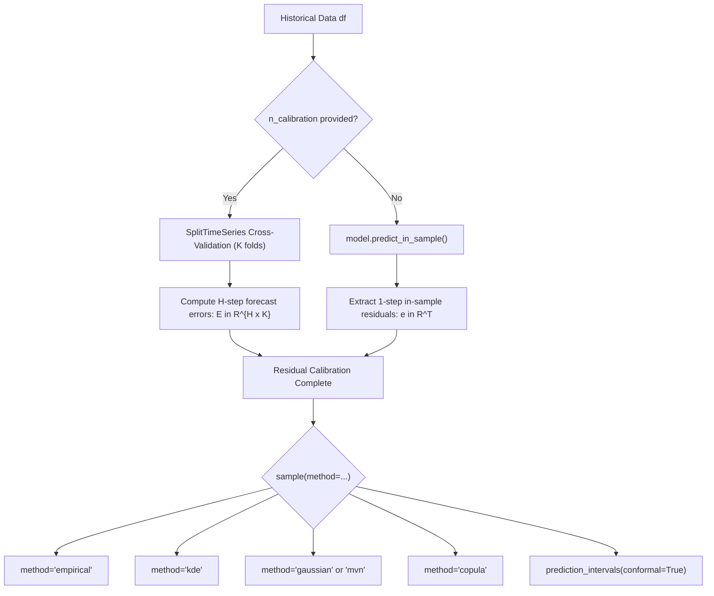
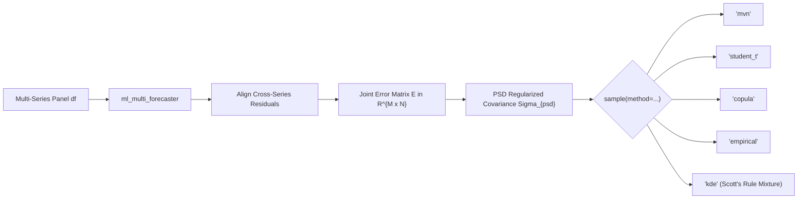

# Executive Overview & Problem Formulation

Point forecasting models produce single-valued conditional expectation trajectories:
$$\hat{\mathbf{y}} = \mathbb{E}[\mathbf{Y}_{T+1:T+H} \mid \mathcal{F}_T]$$
where $\mathcal{F}_T$ denotes the historical filtration available up to forecast origin $T$, and $H$ is the forecast horizon. While point forecasts are essential for baseline planning, operational decision-making (e.g. inventory safety stock, energy grid reserve sizing, financial risk management, and queueing models) requires characterizing the **full predictive probability distribution**:
$$\mathcal{P}\left(\mathbf{Y}_{T+1:T+H} \in \mathcal{A} \mid \mathcal{F}_T\right)$$

In real-world time series, errors exhibit two critical forms of dependency:
1. **Temporal Inter-Horizon Autocorrelation**: A negative shock at step $h=1$ frequently carries forward into step $h=2$. Resampling errors independently across forecast horizons artificially destroys path continuity.
2. **Cross-Sectional Contemporaneous Correlation**: In multi-series settings (e.g., retail store items, regional hospital admissions, sensor networks), shocks in one series are strongly correlated with shocks in others due to shared macro factors, promotions, or supply bottlenecks.

To address these challenges under a unified API, `peshbeen` provides two specialized probabilistic forecasting classes:
- **`prob_forecasts`**: For univariate time series across forecast horizons $h \in \{1, \dots, H\}$.
- **`multi_prob_forecasts`**: For multi-series time series across series $s \in \{1, \dots, N\}$ and horizons $h \in \{1, \dots, H\}$.

---

# Univariate Probabilistic Forecasting (`prob_forecasts`)

## Architecture & Calibration Workflow

`prob_forecasts` wraps any point forecasting model implementing `.fit(df)` and `.forecast(H, exog)`. It operates via a two-stage paradigm:
1. **Calibration**: Collects residual vectors across $K$ expanding/rolling cross-validation windows (`n_calibration=K`) or extracts in-sample training residuals (`n_calibration=None`).
2. **Sampling / Interval Generation**: Generates simulated trajectory paths or conformal prediction intervals using the calibrated residual structure.



---

## Method 1: Empirical Resampling (`method="empirical"`)

### Python Implementation
```python
if method == "empirical":
    if self.n_calib is not None:
        draws = np.column_stack([
            self._rng.choice(self.resid[h], size=n_samples, replace=True)
            for h in range(self.H)
        ])
    else:
        draws = np.column_stack([
            self._rng.choice(self.resid, size=n_samples, replace=True)
            for _ in range(self.H)
        ])
```

### Algorithmic Steps
1. If calibrated across $K$ folds, for each forecast horizon $h \in \{0, 1, \dots, H-1\}$, extract the horizon-specific residual slice $\mathbf{e}_h = [e_{h, 1}, e_{h, 2}, \dots, e_{h, K}]^\top$.
2. If in-sample residuals are used, extract the full vector of residuals $\mathbf{e} = [e_1, \dots, e_T]^\top$.
3. For each horizon $h$, draw $S$ independent samples with replacement from the corresponding residual collection.
4. Assemble draws into an $(S \times H)$ error innovation matrix and add point forecasts: $\mathbf{Y}^{(s)} = \hat{\mathbf{y}} + \mathbf{e}^{(s)}$.

### Mathematical Foundation
Empirical resampling constitutes the classical non-parametric bootstrap (Efron & Tibshirani, 1993). Let $F_h(e) = \mathbb{P}(E_h \le e)$ denote the true unknown cumulative distribution function of forecast errors at step $h$. The empirical cumulative distribution function (eCDF) is:
$$\hat{F}_{h, K}(e) = \frac{1}{K} \sum_{k=1}^K \mathbb{I}(e_{h, k} \le e)$$

By the **Glivenko-Cantelli Theorem**, $\hat{F}_{h, K}$ converges almost surely to $F_h$ uniformly over $\mathbb{R}$:
$$\sup_{e \in \mathbb{R}} \left| \hat{F}_{h, K}(e) - F_h(e) \right| \xrightarrow{a.s.} 0 \quad \text{as } K \to \infty$$

Sampling with replacement from the discrete set $\{e_{h, 1}, \dots, e_{h, K}\}$ is mathematically equivalent to generating pseudo-random variates directly from $\hat{F}_{h, K}$.

**Key Property**: Completely model-free and robust to arbitrary skewness, kurtosis, and multi-modality.

---

## Method 2: Kernel Density Estimation (`method="kde"`)

### Python Implementation
```python
elif method == "kde":
    if self.n_calib is not None:
        draws = np.column_stack([
            gaussian_kde(self.resid[h]).resample(size=n_samples, seed=self._random_state)[0]
            for h in range(self.H)
        ])
    else:
        draws = np.column_stack([
            gaussian_kde(self.resid).resample(size=n_samples, seed=self._random_state)[0]
            for _ in range(self.H)
        ])
```

### Algorithmic Steps
1. For each horizon $h \in \{0, \dots, H-1\}$ (or for the pooled in-sample error array), fit a 1-dimensional continuous Gaussian Kernel Density Estimator $\hat{f}_h(e)$.
2. Compute the optimal smoothing bandwidth via Silverman's rule of thumb.
3. Draw $S$ continuous pseudo-random variates from the estimated probability density function $\hat{f}_h$.
4. Add the smoothed error innovations to the point forecasts.

### Mathematical Foundation
The Parzen-Rosenblatt kernel density estimator (Rosenblatt, 1956; Parzen, 1962) smooths discrete observations into a continuous density:
$$\hat{f}_h(e) = \frac{1}{K \lambda_h} \sum_{k=1}^K K_\phi\left(\frac{e - e_{h, k}}{\lambda_h}\right)$$
where $K_\phi(u) = \frac{1}{\sqrt{2\pi}} \exp\left(-\frac{1}{2}u^2\right)$ is the standard normal kernel, and $\lambda_h$ is the bandwidth parameter.

Under **Silverman's Rule of Thumb** (Silverman, 1986), the bandwidth that minimizes the Asymptotic Mean Integrated Squared Error (AMISE) for Gaussian-like errors is:
$$\lambda_h^* = \hat{\sigma}_h \left(\frac{4}{3K}\right)^{1/5} \approx 1.06 \, \hat{\sigma}_h \, K^{-1/5}$$

Sampling from $\hat{f}_h(e)$ corresponds to a continuous generative mixture:
1. Draw index $k \sim \text{Uniform}(\{1, \dots, K\})$.
2. Draw continuous zero-mean perturbation $w \sim \mathcal{N}(0, \lambda_h^2)$.
3. Simulated error: $\tilde{e} = e_{h, k} + w$.

**Key Property**: Generates novel continuous values outside the finite discrete support of calibration data while retaining non-parametric empirical shape.

---

## Method 3: Gaussian / Multivariate Normal (`method="gaussian"` / `method="mvn"`)

### Python Implementation
```python
elif method in {"gaussian", "mvn"}:
    if self.n_calib is not None:
        cov_mat = np.cov(self.resid, rowvar=True)
        cov_sym = 0.5 * (cov_mat + cov_mat.T)
        eigvals, eigvecs = np.linalg.eigh(cov_sym)
        cov_psd = eigvecs @ np.diag(np.maximum(eigvals, 1e-8)) @ eigvecs.T
        self.sigma = cov_psd
        draws = self._rng.multivariate_normal(np.zeros(self.H), self.sigma, size=n_samples)
    else:
        var_resid = np.var(self.resid)
        std_resid = np.sqrt(max(float(var_resid), 1e-8))
        self.sigma = std_resid ** 2
        draws = self._rng.normal(loc=0.0, scale=std_resid, size=(n_samples, self.H))
```

### Algorithmic Steps

#### Case A: Cross-Validation Calibrated (`n_calibration is not None`)
1. Multi-step forecast errors from $K$ folds form the matrix $\mathbf{E} \in \mathbb{R}^{H \times K}$, where row $h$ corresponds to horizon step $h+1$.
2. Compute the sample covariance matrix $\hat{\mathbf{\Sigma}} = \operatorname{Cov}(\mathbf{E}) \in \mathbb{R}^{H \times H}$.
3. Symmetrize and perform eigenvalue decomposition: $\mathbf{\Sigma}_{\text{sym}} = \mathbf{V} \mathbf{\Lambda} \mathbf{V}^\top$.
4. Enforce Positive Semi-Definiteness (PSD) by projecting eigenvalues onto $[\epsilon, \infty)$ where $\epsilon = 10^{-8}$.
5. Draw $S$ trajectories from the $H$-dimensional Multivariate Normal distribution $\mathcal{N}_H(\mathbf{0}, \mathbf{\Sigma}_{\text{psd}})$.

#### Case B: In-Sample Training Residuals (`n_calibration is None`)
1. Extract 1-step training residuals $\mathbf{e} = [e_1, \dots, e_T]^\top$.
2. Compute the sample variance: $\hat{\sigma}^2 = \frac{1}{T-1} \sum_{t=1}^T (e_t - \bar{e})^2$.
3. Store `self.sigma = std_resid ** 2`.
4. Draw independent normal innovations across the horizon: $e_{s, h} \sim \mathcal{N}(0, \hat{\sigma}^2)$.

### Mathematical Foundation

#### Spectral Positive Semi-Definite Projection
In time series forecasting, calibration windows are often modest relative to the forecast horizon ($K < H$ or $K \approx H$). In such regimes, the empirical covariance matrix $\hat{\mathbf{\Sigma}} = \frac{1}{K-1} \sum_{k=1}^K (\mathbf{e}_k - \bar{\mathbf{e}})(\mathbf{e}_k - \bar{\mathbf{e}})^\top$ has rank at most $\min(H, K-1)$ and may possess negative eigenvalues due to numerical floating-point noise.

By the **Eckart-Young-Mirsky Theorem** under the Frobenius norm, the nearest positive semi-definite matrix to $\hat{\mathbf{\Sigma}}_{\text{sym}}$ is obtained via spectral clipping:
$$\mathbf{\Sigma}_{\text{psd}} = \sum_{i=1}^H \max(\lambda_i, \epsilon) \, \mathbf{v}_i \mathbf{v}_i^\top = \mathbf{V} \operatorname{diag}\left(\max(\lambda_1, \epsilon), \dots, \max(\lambda_H, \epsilon)\right) \mathbf{V}^\top$$

#### Cholesky Trajectory Simulation
Using the lower triangular Cholesky factorization $\mathbf{\Sigma}_{\text{psd}} = \mathbf{L}\mathbf{L}^\top$:
$$\mathbf{e}^{(s)} = \mathbf{L} \mathbf{z}^{(s)}, \quad \text{where } \mathbf{z}^{(s)} \sim \mathcal{N}_H(\mathbf{0}, \mathbf{I}_H)$$
Then:
$$\mathbb{E}[\mathbf{e}^{(s)}] = \mathbf{L} \, \mathbb{E}[\mathbf{z}^{(s)}] = \mathbf{0}$$
$$\operatorname{Cov}(\mathbf{e}^{(s)}) = \mathbf{L} \, \operatorname{Cov}(\mathbf{z}^{(s)}) \, \mathbf{L}^\top = \mathbf{L} \mathbf{I}_H \mathbf{L}^\top = \mathbf{\Sigma}_{\text{psd}}$$

**Key Property**: Preserves inter-horizon correlation, ensuring generated paths mimic realistic temporal smoothness rather than erratic un-correlated jumps.

---

## Method 4: Gaussian Copula with Empirical Marginals (`method="copula"`)

### Python Implementation
```python
elif method == "copula":
    if self.n_calib is not None:
        cov_mat = np.cov(self.resid, rowvar=True)
        cov_sym = 0.5 * (cov_mat + cov_mat.T)
        eigvals, eigvecs = np.linalg.eigh(cov_sym)
        cov_psd = eigvecs @ np.diag(np.maximum(eigvals, 1e-8)) @ eigvecs.T
        stds = np.sqrt(np.diag(cov_psd))
        stds[stds == 0] = 1e-8
        corr_mat = np.clip(cov_psd / np.outer(stds, stds), -1.0, 1.0)
        np.fill_diagonal(corr_mat, 1.0)

        Z = self._rng.multivariate_normal(mean=np.zeros(self.H), cov=corr_mat, size=n_samples)
        U = np.clip(norm.cdf(Z), 1e-6, 1.0 - 1e-6)

        draws = np.zeros((n_samples, self.H))
        for h in range(self.H):
            draws[:, h] = np.quantile(self.resid[h], U[:, h])
    else:
        U = self._rng.uniform(1e-6, 1.0 - 1e-6, size=(n_samples, self.H))
        draws = np.zeros((n_samples, self.H))
        for h in range(self.H):
            draws[:, h] = np.quantile(self.resid, U[:, h])
```

### Mathematical Foundation
By **Sklar's Theorem** (Sklar, 1959), any joint multivariate distribution $F(e_1, \dots, e_H)$ can be uniquely decomposed into its marginal distributions $F_1, \dots, F_H$ and a copula $C$:
$$F(e_1, \dots, e_H) = C\left(F_1(e_1), F_2(e_2), \dots, F_H(e_H)\right)$$

The **Gaussian Copula** parameterizes dependence via an $H \times H$ correlation matrix $\mathbf{R}$:
$$C_{\mathbf{R}}^{\text{Gauss}}(u_1, \dots, u_H) = \Phi_{\mathbf{R}}\left(\Phi^{-1}(u_1), \dots, \Phi^{-1}(u_H)\right)$$
where $\Phi$ is the univariate standard normal CDF and $\Phi_{\mathbf{R}}$ is the joint standard multivariate normal CDF with correlation $\mathbf{R}$.

**Algorithm via Probability Integral Transform**:
1. Sample correlated latent normal vectors: $\mathbf{Z} \sim \mathcal{N}_H(\mathbf{0}, \mathbf{R})$.
2. Map to uniform marginals via standard normal CDF: $U_h = \Phi(Z_h) \in (0, 1)$.
3. Invert the non-parametric empirical quantile function: $\tilde{e}_h = \hat{F}_h^{-1}(U_h)$.

**Key Property**: Decouples the inter-horizon correlation structure from the marginal error distributions, enabling empirical non-Gaussian marginals with Gaussian joint dependence.

---

## Conformal Prediction Intervals (`calibrate()` + `prediction_intervals(conformal=True)`)

### Mathematical Foundation
Conformal prediction (Vovk, Gammerman, & Shafer, 2005) provides non-parametric, finite-sample valid prediction intervals without distributional assumptions.

1. **Non-Conformity Measure**: For each calibration fold $k \in \{1, \dots, K\}$ and horizon $h$:
   $$\alpha_{k, h} = \left| y_{k, h} - \hat{y}_{k, h} \right|$$
2. **Quantile Selection**: To achieve valid $1 - \delta$ coverage (e.g. $\delta = 0.10$ for $90\%$ coverage):
   $$p = \min\left(1.0, \, \frac{\lceil (1 - \delta)(K + 1) \rceil}{K}\right)$$
   $$\hat{q}_h = \text{Quantile}_{p}\left(\{\alpha_{1, h}, \dots, \alpha_{K, h}\}\right)$$
3. **Interval Construction**:
   $$\mathcal{C}_{1-\delta}(y_h) = \left[ \hat{y}_h - \hat{q}_h, \; \hat{y}_h + \hat{q}_h \right]$$

**Coverage Guarantee**:
Under exchangeability of calibration and test errors:
$$\mathbb{P}\left(Y_{T+h} \in \mathcal{C}_{1-\delta}(Y_{T+h})\right) \ge 1 - \delta$$

---

# Multi-Series Probabilistic Forecasting (`multi_prob_forecasts`)

## Architecture & Calibration Workflow

`multi_prob_forecasts` operates over a panel of $N$ interdependent time series across forecast horizon $H$. It constructs the **Joint Error Matrix** under two distinct calibration regimes:

1. **Cross-Validation Calibration (`n_calibration = K`) — Full Cross-Series & Cross-Horizon Covariance**:
   In each fold $k \in \{1, \dots, K\}$, the forecaster generates multi-step predictions $\hat{y}_{s, h, k}$ for every series $s$ across all horizons $h \in \{1, \dots, H\}$. The errors are concatenated into a $D = (H \cdot N)$-dimensional joint trajectory vector:
   $$\mathbf{e}_k = \left[ e_{1, 1, k}, \, e_{2, 1, k}, \, \dots, \, e_{N, 1, k}, \, e_{1, 2, k}, \, \dots, \, e_{N, H, k} \right]^\top \in \mathbb{R}^{H \cdot N}$$
   Arranged into the $(K \times HN)$ Joint Error Matrix:
   $$\mathbf{E} \in \mathbb{R}^{K \times (H \cdot N)}$$
   The regularized covariance matrix $\mathbf{\Sigma}_{\text{psd}} \in \mathbb{R}^{(HN) \times (HN)}$ captures **both contemporaneous cross-series correlation AND multi-step cross-horizon autocovariance**.

2. **In-Sample Residuals (`n_calibration = None`) — Cross-Sectional Covariance**:
   When calibration is omitted, 1-step in-sample residuals from $M$ historical time steps form an $(M \times N)$ error matrix:
   $$\mathbf{E} \in \mathbb{R}^{M \times N}$$
   yielding an $(N \times N)$ cross-series covariance matrix $\mathbf{\Sigma}_{\text{psd}} \in \mathbb{R}^{N \times N}$.



---

## Method 1: Multivariate Normal (`method="mvn"`)

### Python Implementation
```python
if method == "mvn":
    if self.n_calib is not None:
        innov_flat = rng.multivariate_normal(mean=np.zeros(self.H * N), cov=cov_psd, size=n_samples)
        innovations = innov_flat.reshape(n_samples, self.H, N)
    else:
        innovations = np.zeros((n_samples, self.H, N))
        for h in range(self.H):
            innovations[:, h, :] = rng.multivariate_normal(mean=np.zeros(N), cov=cov_psd, size=n_samples)
```

### Mathematical Formulation
- **When Calibrated (`n_calibration=K`)**:
  Draws full multi-step trajectory vectors simultaneously from the $(H \cdot N)$-dimensional Multivariate Normal:
  $$\mathbf{e}^{(s)} \sim \mathcal{N}_{HN}\left(\mathbf{0}, \, \mathbf{\Sigma}_{\text{psd}}\right) \in \mathbb{R}^{H \cdot N}$$
  Reshaped to $(H \times N)$ per simulated path. This preserves both cross-series contemporaneous relationships and temporal auto-correlations across forecast horizons $h=1, \dots, H$.
- **When In-Sample (`n_calibration=None`)**:
  Draws $N$-dimensional contemporaneous normal vectors $\mathbf{e}_h \sim \mathcal{N}_N(\mathbf{0}, \mathbf{\Sigma}_{\text{psd}})$ independently for each horizon step.

---

## Method 2: Multivariate Student-$t$ (`method="student_t"`)

### Python Implementation
```python
elif method == "student_t":
    if self.n_calib is not None:
        D = self.H * N
        Z = rng.multivariate_normal(mean=np.zeros(D), cov=cov_psd, size=n_samples)
        W = rng.chisquare(df=df_t_deg, size=(n_samples, 1))
        scale = np.sqrt(W / df_t_deg)
        innovations = (Z / scale).reshape(n_samples, self.H, N)
    else:
        innovations = np.zeros((n_samples, self.H, N))
        for h in range(self.H):
            Z_h = rng.multivariate_normal(mean=np.zeros(N), cov=cov_psd, size=n_samples)
            W_h = rng.chisquare(df=df_t_deg, size=(n_samples, 1))
            scale_h = np.sqrt(W_h / df_t_deg)
            innovations[:, h, :] = Z_h / scale_h
```

### Mathematical Formulation
The Multivariate Student-$t$ distribution $t_N(\nu, \mathbf{0}, \mathbf{\Sigma})$ is represented as a scale mixture of Gaussians:
$$\mathbf{X} = \frac{\mathbf{Z}}{\sqrt{W / \nu}}$$
where:
- $\mathbf{Z} \sim \mathcal{N}_N(\mathbf{0}, \mathbf{\Sigma})$
- $W \sim \chi^2(\nu)$ is an independent chi-squared scalar with $\nu$ degrees of freedom (`df_t_deg`).

**Statistical Utility**: For $\nu \le 5$, the distribution exhibits heavy power-law tails. Extreme shocks (e.g. system-wide demand surges or liquidity events) occur jointly across multiple series with substantially higher probability than under a thin-tailed Gaussian distribution.

---

## Method 3: Gaussian Copula (`method="copula"`)

### Python Implementation
```python
elif method == "copula":
    if self.n_calib is not None:
        D = self.H * N
        Z = rng.multivariate_normal(mean=np.zeros(D), cov=corr_mat, size=n_samples)
        U = np.clip(norm.cdf(Z), 1e-6, 1.0 - 1e-6)
        innovations = np.zeros((n_samples, self.H, N))
        for h in range(self.H):
            for j, s in enumerate(series_ids):
                u_hj = U[:, h * N + j]
                s_res = self.resid[s][h]
                innovations[:, h, j] = np.quantile(s_res, u_hj)
    else:
        innovations = np.zeros((n_samples, self.H, N))
        for h in range(self.H):
            Z_h = rng.multivariate_normal(mean=np.zeros(N), cov=corr_mat, size=n_samples)
            U_h = norm.cdf(Z_h)
            U_h = np.clip(U_h, 1e-6, 1.0 - 1e-6)
            for j, s in enumerate(series_ids):
                s_res = self.joint_error_matrix[:, j]
                innovations[:, h, j] = np.quantile(s_res, U_h[:, j])
```

### Mathematical Formulation
Couples the regularized cross-series correlation matrix $\mathbf{R} \in \mathbb{R}^{N \times N}$ with the empirical 1-dimensional marginal quantiles $\hat{F}_j^{-1}(u)$ of each individual series $j \in \{1, \dots, N\}$.

---

## Method 4: Joint Empirical Resampling (`method="empirical"`)

### Python Implementation
```python
elif method == "empirical":
    if self.n_calib is not None:
        n_rows = len(self.joint_error_matrix)
        row_indices = rng.choice(n_rows, size=n_samples, replace=True)
        innovations = self.joint_error_matrix[row_indices, :].reshape(n_samples, self.H, N)
    else:
        n_rows = len(self.joint_error_matrix)
        innovations = np.zeros((n_samples, self.H, N))
        for h in range(self.H):
            row_indices = rng.choice(n_rows, size=n_samples, replace=True)
            innovations[:, h, :] = self.joint_error_matrix[row_indices, :]
```

### Mathematical Formulation
Resamples complete rows $\mathbf{e}_m = [e_{m, 1}, \dots, e_{m, N}]$ with replacement. Preserves non-linear dependency structures, asymmetric joint tail clustering, and empirical bounds without parametric assumptions.

---

## Method 5: Independent Series-Wise Empirical Resampling (`method="ind_empirical"` or `"ind_emp"`)

### Python Implementation
```python
elif method == "ind_empirical":
    innovations = np.zeros((n_samples, self.H, N))
    for j, s in enumerate(series_ids):
        if self.n_calib is not None:
            for h in range(self.H):
                innovations[:, h, j] = rng.choice(self.resid[s][h], size=n_samples, replace=True)
        else:
            for h in range(self.H):
                innovations[:, h, j] = rng.choice(self.resid[s], size=n_samples, replace=True)
```

### Mathematical Formulation
When cross-series correlation is weak, noisy, or intentionally ignored to avoid over-fitting cross-sectional covariance, `ind_empirical` samples historical errors independently for each series $s \in \{1, \dots, N\}$ and horizon $h \in \{1, \dots, H\}$.

For each series $s$:
- If calibrated (`n_calibration=K`): draws uniformly with replacement from the multi-step fold residuals $\{e_{s, h, 1}, \dots, e_{s, h, K}\}$.
- If in-sample (`n_calibration=None`): draws uniformly with replacement from the pooled historical residuals $\{e_{s, 1}, \dots, e_{s, T}\}$.

This matches the behavior of univariate `prob_forecasts` independently executed across all $N$ series.

---

## Method 6: Independent Series-Wise Kernel Density Estimation (`method="ind_kde"`)

### Python Implementation
```python
elif method == "ind_kde":
    innovations = np.zeros((n_samples, self.H, N))
    for j, s in enumerate(series_ids):
        if self.n_calib is not None:
            for h in range(self.H):
                try:
                    kde_h = gaussian_kde(self.resid[s][h])
                    innovations[:, h, j] = kde_h.resample(size=n_samples, seed=rng.integers(0, 1_000_000))[0]
                except Exception:
                    innovations[:, h, j] = rng.choice(self.resid[s][h], size=n_samples, replace=True)
        else:
            try:
                kde_s = gaussian_kde(self.resid[s])
                for h in range(self.H):
                    innovations[:, h, j] = kde_s.resample(size=n_samples, seed=rng.integers(0, 1_000_000))[0]
            except Exception:
                for h in range(self.H):
                    innovations[:, h, j] = rng.choice(self.resid[s], size=n_samples, replace=True)
```

### Mathematical Formulation
Instead of fitting a single high-dimensional joint KDE with bandwidth matrix $\mathbf{H} \in \mathbb{R}^{N \times N}$, `ind_kde` fits independent 1-dimensional Parzen-Rosenblatt kernel density estimates on the residuals of each series $s$:
$$\hat{f}_{s, h}(e) = \frac{1}{K \lambda_{s, h}} \sum_{k=1}^K K_\phi\left(\frac{e - e_{s, h, k}}{\lambda_{s, h}}\right)$$

Because each kernel estimator is strictly 1-dimensional, it is **completely immune to the curse of dimensionality**, scaling efficiently to thousands of series while providing smooth, continuous non-parametric predictive distributions without discrete sampling artifacts.

---

# Deep-Dive: Multivariate Kernel Density Estimation (`method="kde"`)

## The Code Under Scrutiny

```python
elif method == "kde":
    if self.n_calib is not None:
        D = self.H * N
        M_rows = len(self.joint_error_matrix)
        bw_factor = M_rows ** (-1.0 / (D + 4.0))
        kde_cov = (bw_factor ** 2) * cov_psd
        row_indices = rng.choice(M_rows, size=n_samples, replace=True)
        centers = self.joint_error_matrix[row_indices, :]
        noise = rng.multivariate_normal(mean=np.zeros(D), cov=kde_cov, size=n_samples)
        innovations = (centers + noise).reshape(n_samples, self.H, N)
    else:
        M_rows = len(self.joint_error_matrix)
        bw_factor = M_rows ** (-1.0 / (N + 4.0))
        kde_cov = (bw_factor ** 2) * cov_psd
        innovations = np.zeros((n_samples, self.H, N))
        for h in range(self.H):
            row_indices = rng.choice(M_rows, size=n_samples, replace=True)
            centers = self.joint_error_matrix[row_indices, :]
            noise = rng.multivariate_normal(mean=np.zeros(N), cov=kde_cov, size=n_samples)
            innovations[:, h, :] = centers + noise
```

Let us dissect each component with mathematical precision.

---

## Line 1: Sample Size and Dimensionality
```python
M_rows = len(self.joint_error_matrix)
```
- $M$: The number of available contemporaneous residual observations (sample size).
- $N$: The number of time series (dimension of the random vector space $\mathbb{R}^N$).

---

## Line 2: The Bandwidth Factor $M^{-1/(N+4)}$ (Scott's Rule of Thumb)
```python
bw_factor = M_rows ** (-1.0 / (N + 4.0))
```

### The Parzen-Rosenblatt Estimator in $\mathbb{R}^N$
Let $\mathbf{x}_1, \dots, \mathbf{x}_M \in \mathbb{R}^N$ be independent identically distributed error vectors. The multivariate kernel density estimator with symmetric bandwidth matrix $\mathbf{H} \in \mathbb{R}^{N \times N}$ is defined as:
$$\hat{f}(\mathbf{x}) = \frac{1}{M |\mathbf{H}|^{1/2}} \sum_{m=1}^M K\left(\mathbf{H}^{-1/2}(\mathbf{x} - \mathbf{x}_m)\right)$$
where $K(\mathbf{u}) = (2\pi)^{-N/2} \exp\left(-\frac{1}{2}\mathbf{u}^\top \mathbf{u}\right)$ is the standard Gaussian kernel.

### Derivation from the AMISE Bias-Variance Tradeoff
The quality of a density estimator is measured by the **Mean Integrated Squared Error (MISE)**:
$$\operatorname{MISE}(\hat{f}) = \mathbb{E}\left[\int_{\mathbb{R}^N} \left(\hat{f}(\mathbf{x}) - f(\mathbf{x})\right)^2 d\mathbf{x}\right] = \int_{\mathbb{R}^N} \operatorname{Var}(\hat{f}(\mathbf{x})) d\mathbf{x} + \int_{\mathbb{R}^N} \left(\operatorname{Bias}(\hat{f}(\mathbf{x}))\right)^2 d\mathbf{x}$$

Using a multivariate Taylor expansion (Scott, 1992; Wand & Jones, 1995), the asymptotic approximations are:
1. **Asymptotic Integrated Variance**:
   $$\operatorname{IVar}(\hat{f}) = \frac{1}{M |\mathbf{H}|^{1/2}} R(K) = \frac{1}{M |\mathbf{H}|^{1/2}} (4\pi)^{-N/2}$$
2. **Asymptotic Integrated Squared Bias**:
   $$\operatorname{ISB}(\hat{f}) = \frac{1}{4} \mu_2(K)^2 \int_{\mathbb{R}^N} \left(\operatorname{tr}\left(\mathbf{H} \, \mathcal{H}_f(\mathbf{x})\right)\right)^2 d\mathbf{x}$$
   where $\mathcal{H}_f(\mathbf{x}) = \nabla^2 f(\mathbf{x})$ is the Hessian matrix of $f$.

If we set the bandwidth matrix proportional to the data covariance matrix:
$$\mathbf{H} = b^2 \mathbf{\Sigma}$$
then $|\mathbf{H}|^{1/2} = (b^2)^{N/2} |\mathbf{\Sigma}|^{1/2} = b^N |\mathbf{\Sigma}|^{1/2}$.

Substituting this into the Asymptotic MISE (AMISE):
$$\operatorname{AMISE}(b) = \frac{C_1}{M b^N} + C_2 \, b^4$$
where $C_1, C_2 > 0$ are constants depending on $N$ and $\mathbf{\Sigma}$.

To find the optimal bandwidth scale $b^*$, differentiate with respect to $b$:
$$\frac{d}{db} \operatorname{AMISE}(b) = -\frac{N C_1}{M b^{N+1}} + 4 C_2 b^3 = 0$$
$$4 C_2 b^3 = \frac{N C_1}{M b^{N+1}} \implies b^{N+4} = \frac{N C_1}{4 C_2} \cdot \frac{1}{M}$$
Taking the $(N+4)$-th root:
$$b^* \propto M^{-\frac{1}{N+4}}$$

This proves why the bandwidth factor must scale exactly as $M^{-1/(N+4)}$. This is known as **Scott's Rule of Thumb** (Scott, 1992).

---

## Line 3: Bandwidth Covariance Scaling
```python
kde_cov = (bw_factor ** 2) * cov_psd
```

Because $\mathbf{H} = b^2 \mathbf{\Sigma}$, the covariance matrix governing the Gaussian kernel is:
$$\mathbf{H} = \left(M^{-\frac{1}{N+4}}\right)^2 \mathbf{\Sigma}_{\text{psd}} = M^{-\frac{2}{N+4}} \mathbf{\Sigma}_{\text{psd}}$$

### Why multiply by `cov_psd` instead of the Identity matrix $\mathbf{I}_N$?
If one smoothed using a spherical kernel $\mathbf{H} = b^2 \mathbf{I}_N$, the smoothing would be isotropic (equal in all directions), ignoring the fact that error variables may have wildly different variances and strong cross-correlations.

By using $\mathbf{H} = b^2 \mathbf{\Sigma}_{\text{psd}}$:
- The iso-density contours of the smoothing kernel are **ellipsoids** oriented along the eigenvectors of $\mathbf{\Sigma}_{\text{psd}}$.
- Variables with larger variance receive proportionally wider smoothing.
- Strongly correlated series are smoothed along their ridge of correlation, preventing probability mass from spilling into impossible orthogonal regions.

---

## Lines 4–10: Generative Mixture Sampling Without Numerical Integration
```python
row_indices = rng.choice(M_rows, size=n_samples, replace=True)
centers = self.joint_error_matrix[row_indices, :]
noise = rng.multivariate_normal(mean=np.zeros(N), cov=kde_cov, size=n_samples)
innovations[:, h, :] = centers + noise
```

### The Continuous Mixture Representation
Notice that $\hat{f}(\mathbf{x})$ is an equally weighted mixture of $M$ Gaussian distributions centered at the observed data points $\mathbf{x}_m$:
$$\hat{f}(\mathbf{x}) = \frac{1}{M} \sum_{m=1}^M \mathcal{N}_N\left(\mathbf{x}; \, \mathbf{x}_m, \, \mathbf{H}\right)$$

Directly evaluating or numerically integrating an $N$-dimensional density grid is computationally intractable (curse of dimensionality). However, **generating random variates from this mixture is exact and instantaneous**:

1. **Component Selection**:
   Draw an observation index $m^* \sim \text{DiscreteUniform}(1, M)$.
   In code:
   `row_indices = rng.choice(M_rows, size=n_samples, replace=True)`
   `centers = self.joint_error_matrix[row_indices, :]`

2. **Kernel Noise Generation**:
   Draw a random perturbation vector from the Gaussian kernel centered at zero:
   $$\mathbf{w} \sim \mathcal{N}_N(\mathbf{0}, \mathbf{H})$$
   In code:
   `noise = rng.multivariate_normal(mean=np.zeros(N), cov=kde_cov, size=n_samples)`

3. **Additive Convolution**:
   $$\tilde{\mathbf{e}} = \mathbf{x}_{m^*} + \mathbf{w}$$
   In code:
   `innovations[:, h, :] = centers + noise`

### Moment Properties of the KDE Draws
By the law of total expectation:
$$\mathbb{E}[\tilde{\mathbf{e}}] = \mathbb{E}[\mathbf{x}_{m^*}] + \mathbb{E}[\mathbf{w}] = \bar{\mathbf{x}} + \mathbf{0} = \bar{\mathbf{x}}$$

By the law of total covariance:
$$\operatorname{Cov}(\tilde{\mathbf{e}}) = \operatorname{Cov}(\mathbf{x}_{m^*}) + \operatorname{Cov}(\mathbf{w}) = \hat{\mathbf{\Sigma}} + \mathbf{H} = \left(1 + b^2\right) \hat{\mathbf{\Sigma}}$$

As $M \to \infty$, $b \to 0$, so $\operatorname{Cov}(\tilde{\mathbf{e}}) \to \hat{\mathbf{\Sigma}}$. For finite $M$, the slight expansion factor $(1 + b^2)$ provides the necessary regularization to account for sample uncertainty.

---

# Summary Comparison Matrix

| Method | Applicable Classes | Target Scope | Inter-Horizon Covariance | Cross-Series Covariance | Tail Weight Flexibility | Non-Gaussian Marginals | Computational Complexity |
| :--- | :--- | :--- | :---: | :---: | :---: | :---: | :---: |
| **`empirical`** | `prob_forecasts`, `multi_prob_forecasts` | Discrete empirical | Horizon-by-horizon (Univariate) / Contemporaneous (Multi) | Yes (Multi joint rows) | Empirical | Yes (Exact empirical) | $\mathcal{O}(S \cdot H \cdot N)$ |
| **`ind_empirical`** | `multi_prob_forecasts` | Discrete empirical per series | Horizon-by-horizon | No (Independent per series) | Empirical | Yes (Exact empirical) | $\mathcal{O}(S \cdot H \cdot N)$ |
| **`kde`** | `prob_forecasts`, `multi_prob_forecasts` | Continuous smoothed non-parametric | Horizon-by-horizon (Univariate) | Yes (Multi, Scott's mixture) | Continuous smoothed | Yes (Kernel smoothed) | $\mathcal{O}(S \cdot H \cdot N)$ |
| **`ind_kde`** | `multi_prob_forecasts` | Continuous smoothed 1D KDE per series | Horizon-by-horizon | No (Independent per series) | Continuous smoothed | Yes (1D Kernel smoothed) | $\mathcal{O}(S \cdot H \cdot N)$ |
| **`gaussian` / `mvn`** | `prob_forecasts`, `multi_prob_forecasts` | Continuous parametric Gaussian | Full $H \times H$ (Univariate) | Full $N \times N$ (Multi) | Light (Gaussian) | No (Elliptical) | $\mathcal{O}(H^3 + S \cdot H)$ or $\mathcal{O}(N^3 + S \cdot N)$ |
| **`student_t`** | `multi_prob_forecasts` | Continuous parametric heavy-tailed | N/A | Full $N \times N$ (Multi) | Heavy (Controlled by $\nu$) | No (Elliptical) | $\mathcal{O}(N^3 + S \cdot N)$ |
| **`copula`** | `prob_forecasts`, `multi_prob_forecasts` | Semi-parametric Copula | Full $H \times H$ (Univariate) | Full $N \times N$ (Multi) | Empirical tails | Yes (Quantile inverted) | $\mathcal{O}(H^3 + S \cdot H \log K)$ |
| **`conformal`** | `prob_forecasts`, `multi_prob_forecasts` | Finite-sample valid intervals | Individual horizons | Individual series | Distribution-free | Model-free | $\mathcal{O}(K \log K)$ |

---

# References

1. **Scott, D. W. (1992)**. *Multivariate Density Estimation: Theory, Practice, and Visualization*. John Wiley & Sons, New York.
2. **Silverman, B. W. (1986)**. *Density Estimation for Statistics and Data Analysis*. Chapman and Hall, London.
3. **Sklar, M. (1959)**. *Fonctions de répartition à n dimensions et leurs marges*. Publications de l'Institut de Statistique de l'Université de Paris, 8, 229–231.
4. **Efron, B., & Tibshirani, R. J. (1993)**. *An Introduction to the Bootstrap*. Chapman & Hall/CRC, New York.
5. **Vovk, V., Gammerman, A., & Shafer, G. (2005)**. *Algorithmic Learning in a Random World*. Springer, Boston, MA.
6. **Wand, M. P., & Jones, M. C. (1995)**. *Kernel Smoothing*. Chapman and Hall/CRC, London.
7. **Rosenblatt, M. (1956)**. Remarks on some non-parametric estimates of a density function. *The Annals of Mathematical Statistics*, 27(3), 832–837.
8. **Parzen, E. (1962)**. On estimation of a probability density function and mode. *The Annals of Mathematical Statistics*, 33(3), 1065–1076.
9. **Ledoit, O., & Wolf, M. (2004)**. A well-conditioned estimator for large-dimensional covariance matrices. *Journal of Multivariate Analysis*, 88(2), 365–411.
