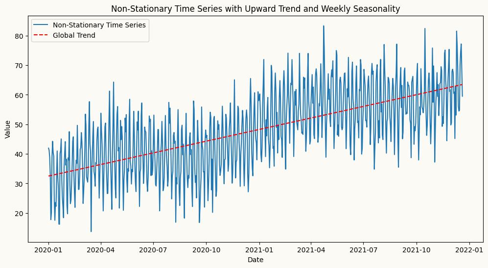
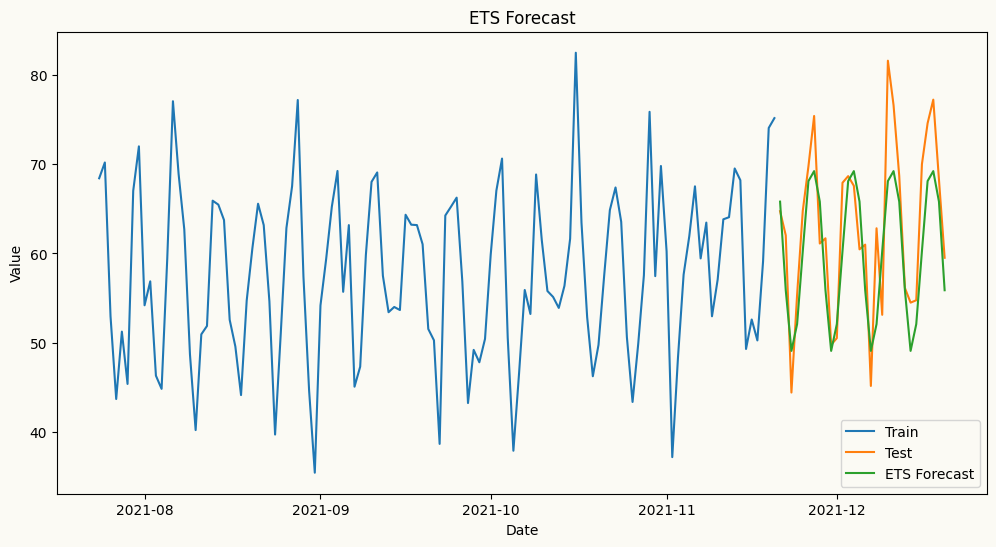
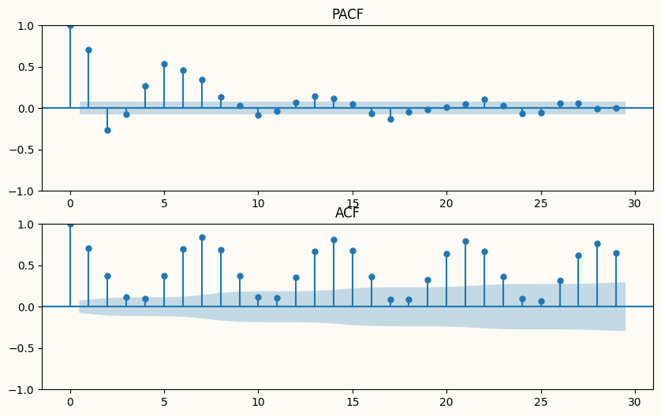
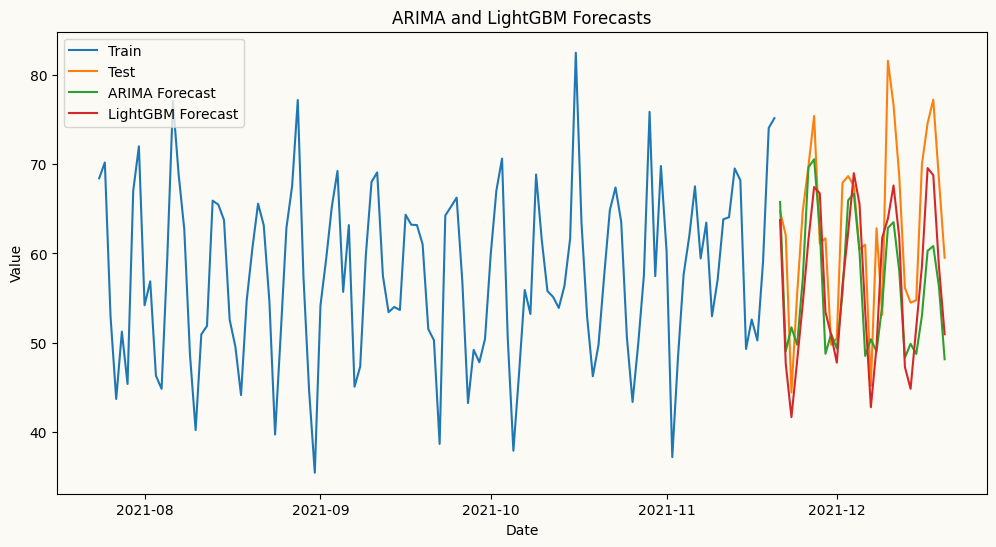
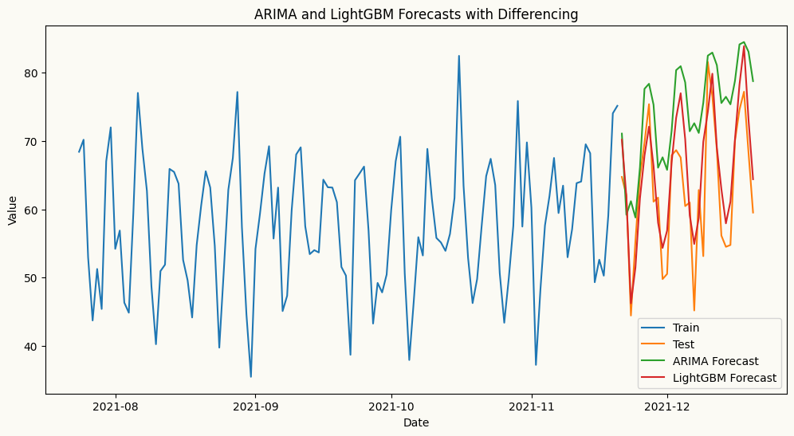
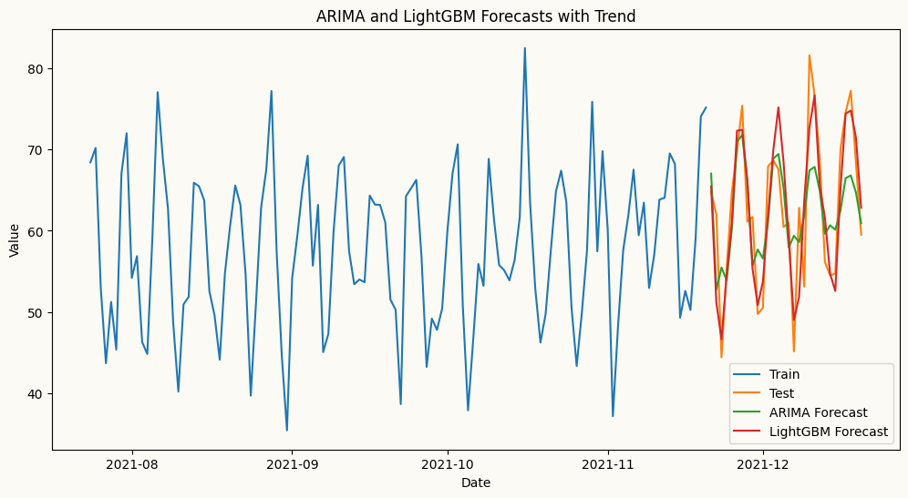

<!-- WARNING: THIS FILE WAS AUTOGENERATED! DO NOT EDIT! -->

## Models zoo

The table below lists the models along with their descriptions and usage
examples.

### Univariate forecasters

<table>
<colgroup>
<col style="width: 27%" />
<col style="width: 30%" />
<col style="width: 41%" />
</colgroup>
<thead>
<tr>
<th><strong>Models</strong></th>
<th><strong>Description</strong></th>
<th><strong>Usage Example</strong></th>
</tr>
</thead>
<tbody>
<tr>
<td>Naive Forecaster</td>
<td>A simple forecasting model that uses the last observed value or last
seasonal value as the forecast.</td>
<td><code> from peshbeen.models import naive <br> model =
naive(target_col=‘target column name’, season_period=None) <br>
model.fit(df) <br> forecasts = model.forecast(H=10)</td>
</tr>
<tr>
<td>ETS (Exponential Smoothing state space models)</td>
<td>ETS forecaster that wraps the <code>statsmodels</code>
implementation, allowing for easy integration and forecasting.</td>
<td><code> from peshbeen.models import ets <br> model =
ets(target_col=‘target column name’, trend=‘add’, seasonal=‘add’,
seasonal_periods=12, smoothing_level=0.1, smoothing_trend=0.1,
smoothing_seasonal=0.1) <br> model.fit(df) <br> forecasts =
model.forecast(H=10)</td>
</tr>
<tr>
<td>ARIMA (AutoRegressive Integrated Moving Average)</td>
<td>ARIMA — a fast, familiar forecaster backed by Nixtla’s
<code>statsforecast</code> implementation, the fastest ARIMA in
Python.</td>
<td><code> from peshbeen.models import arima <br> model =
arima(target_col=‘target column name’, order=(1, 1, 1)) <br>
model.fit(df) <br> forecasts = model.forecast(H=10)</td>
</tr>
<tr>
<td>Machine Learning Regressors — any scikit-learn-compatible regressor,
from LinearRegression, RandomForest and AdaBoost to XGBoost, LightGBM,
and CatBoost.</td>
<td>A unified forecasting wrapper for any compatible regression
model.</td>
<td><code> from peshbeen.models import ml_forecaster <br> from
sklearn.ensemble import RandomForestRegressor <br> model =
ml_forecaster(target_col=‘target column name’,
estimator=RandomForestRegressor(n_estimators=100)) <br> model.fit(df)
<br> forecasts = model.forecast(H=10)</td>
</tr>
<tr>
<td>MS-ARR (Markov-Switching AutoRegressive Regression)</td>
<td>Models time series with hidden regime changes (e.g. recession
vs. growth, low vs. high volatility) using autoregressive dynamics and
optional exogenous variables.</td>
<td><code> from peshbeen.models import ms_arr <br> model =
ms_arr(target_col=‘target column name’, n_components=2, lags = 2,
n_iter=100) <br> model.fit(df) <br> forecasts =
model.forecast(H=10)</td>
</tr>
</tbody>
</table>

### Multivariate forecasters

<table>
<colgroup>
<col style="width: 27%" />
<col style="width: 30%" />
<col style="width: 41%" />
</colgroup>
<thead>
<tr>
<th><strong>Models</strong></th>
<th><strong>Description</strong></th>
<th><strong>Usage Example</strong></th>
</tr>
</thead>
<tbody>
<tr>
<td>VAR (Vector AutoRegression)</td>
<td>A pure-NumPy multivariate forecaster that models linear
interdependencies across multiple time series, with per-series lag
structure control.</td>
<td><code> from peshbeen.models import var <br> model =
var(target_cols=[‘target column 1’, ‘target column 2’], lags={‘target
column 1’: 2, ‘target column 2’: [1, 2, 7]}) <br> model.fit(df) <br>
forecasts = model.forecast(H=10)</td>
</tr>
<tr>
<td>Machine Learning Regressors (multivariate) — any
scikit-learn-compatible regressor, from LinearRegression and
RandomForest to XGBoost, LightGBM, and CatBoost.</td>
<td>Forecasts multiple series simultaneously by leveraging
interdependencies among them, using any scikit-learn-compatible
regressor.</td>
<td><code> from peshbeen.models import ml_mv_forecaster <br> from
lightgbm import LGBMRegressor <br> model =
ml_mv_forecaster(target_cols=[‘target column 1’, ‘target column 2’],
estimator=LGBMRegressor(n_estimators=100, learning_rate=0.1),
lags={‘target column 1’: 2, ‘target column 2’: [1, 2, 7]}) <br>
model.fit(df) <br> forecasts = model.forecast(H=10)</td>
</tr>
<tr>
<td>MS-VAR (Markov-Switching Vector AutoRegression)</td>
<td>A multivariate extension of MS-ARR that models multiple time series
with hidden regime changes using vector autoregressive dynamics and
optional exogenous variables.</td>
<td><code> from peshbeen.models import ms_var <br> model =
ms_var(target_cols=[‘target column 1’, ‘target column 2’],
n_components=2, lags={‘target column 1’: 2, ‘target column 2’: [1, 2,
7]}, n_iter=100) <br> model.fit(df) <br> forecasts =
model.forecast(H=10)</td>
</tr>
</tbody>
</table>

## Stationarity & Detrending Strategies

**What is stationarity?**

Stationarity is a fundamental concept in time series analysis that
refers to the statistical properties of a time series being constant
over time. A stationary time series has a constant mean, variance, and
autocorrelation structure, which allows for more reliable modeling and
forecasting. Non-stationary time series, on the other hand, exhibit
trends, seasonality, or changing variance, making them more challenging
to model accurately.

**Why is stationarity important?**

Many forecasting models, especially traditional statistical models like
ARIMA and Machine Learning Regressors, assume that the underlying time
series is stationary. If the data is non-stationary, these models may
produce biased or inaccurate forecasts. By ensuring stationarity through
techniques like differencing and detrending, we can improve the
performance of these models and obtain more reliable forecasts.

The time series below is non-stationary, with an upward trend and weekly
seasonality. We will use this time series to demonstrate how to apply
different forecasting models, such as ETS, ARIMA, and Machine Learning
models.

``` python
import pandas as pd
import numpy as np
import matplotlib.pyplot as plt
date_range = pd.date_range(start='2020-01-01', periods=720, freq='D')
# create a non-stationary time series with an upward trend weekly seasonality, yearly seasonality and some noise
np.random.seed(42)
data = 30 + 0.05 * np.arange(720) + 12 * np.sin(2 * np.pi * date_range.dayofyear / 7) + 5 * np.sin(2 * np.pi * date_range.dayofyear / 365) + np.random.normal(0, 5, 720)

time_series = pd.DataFrame(data, index=date_range, columns=['Value'])

# plot trend line using linear regression
from sklearn.linear_model import LinearRegression
X = np.arange(len(time_series)).reshape(-1, 1)
y = time_series['Value'].values
model = LinearRegression()
model.fit(X, y)
trend_line = model.predict(X)


plt.figure(figsize=(12, 6))
plt.plot(time_series.index, time_series['Value'], label='Non-Stationary Time Series')
plt.plot(time_series.index, trend_line, label='Global Trend', color='red', linestyle='--')
plt.title('Non-Stationary Time Series with Upward Trend and Weekly Seasonality')
plt.xlabel('Date')
plt.ylabel('Value')
plt.legend()
plt.show()
```



Here, we forecast the same series using multiple models — starting with
ETS, which handles non-stationary data natively, then ARIMA and ML
regressors, where peshbeen’s built-in detrending and transformation
pipeline takes care of stationarity automatically.

**ETS Example**

``` python
from lightgbm import LGBMRegressor
train = time_series.iloc[:-30]
test = time_series.iloc[-30:]
from peshbeen.models import ets, arima, ml_forecaster
ets_model = ets(target_col='Value', seasonal = 'additive', seasonal_periods=7)
ets_model.fit(train)
ets_forecast = ets_model.forecast(H=30)
# plot the forecast
plt.figure(figsize=(12, 6))
plt.plot(train.index[-120:], train['Value'][-120:], label='Train')
plt.plot(test.index, test['Value'], label='Test')
plt.plot(test.index, ets_forecast, label='ETS Forecast')
plt.title('ETS Forecast')
plt.xlabel('Date')
plt.ylabel('Value')
plt.legend()
plt.show()
```



**ARIMA Example**

Arima automatically applies differencing to make the series stationary
by specifying the order of differencing (d) in the model parameters. In
this example, we set d=1 to apply first-order differencing, which helps
to remove the trend and make the series stationary for ARIMA modeling.
To guide lag selection, we can also visualize the ACF and PACF plots of
the original series to identify the ideal number of autoregressive (p)
and moving average (q) terms for the ARIMA model. The ACF plot helps to
identify the number of MA terms, while the PACF plot helps to identify
the number of AR terms. As shown in the plots below, the ACF plot
exhibits a slow decay, indicating non-stationarity, while the PACF plot
shows significant spikes at lags 1 and 2, suggesting that an AR(2) model
may be appropriate for the ARIMA model.

``` python
from statsmodels.graphics.tsaplots import plot_acf, plot_pacf

fig, axes = plt.subplots(2, 1, figsize=(10, 6))

ward_cols_ =  ['blake', 'mulberry', 'juniper', 'magnolia', 'clare', 'anderson', 'other']
anon_wnames = ["Ward A", "Ward B", "Ward C", "Ward D", "Ward E", "Ward F", "Ward G"]

plot_pacf(train["Value"], ax=axes[0], title="PACF")
plot_acf(train["Value"], ax=axes[1], title="ACF")
plt.show()
```



Let’s see how the forecasts look when doesn’t apply differencing for
ARIMA and machine learning forecasters using LightGBMRegressor as
regressor.

``` python
# arima forecast
arima_model = arima(target_col='Value', order=(2,0,0), seasonal_order=(1,0,0), seasonal_length=7)
arima_model.fit(train)
arima_forecast = arima_model.forecast(H=30)

# ml forecast using lightgbm
lgb_model = ml_forecaster(target_col='Value',model=LGBMRegressor(verbose=-1, n_estimators=100, learning_rate=0.1), lags=7, trend='ets')
lgb_model.fit(train)
lgb_forecast = lgb_model.forecast(H=30)

# plot the forecast
plt.figure(figsize=(12, 6))
plt.plot(train.index[-120:], train['Value'][-120:], label='Train')
plt.plot(test.index, test['Value'], label='Test')
plt.plot(test.index, arima_forecast, label='ARIMA Forecast')
plt.plot(test.index, lgb_forecast, label='LightGBM Forecast')
plt.title('ARIMA and LightGBM Forecasts')
plt.xlabel('Date')
plt.ylabel('Value')
plt.legend()
plt.show()
```



As shown in the plot above, the forecasts from the ARIMA model without
differencing are underforecasting the upward trend in the data,
resulting in forecasts that are significantly lower than the actual
values. This highlights the importance of applying differencing to
achieve stationarity when using ARIMA models, as it allows the model to
capture the underlying patterns and trends in the data more effectively,
leading to more accurate forecasts. Now, let’s see how the forecasts
look when we apply differencing for ARIMA.

``` python
# arima forecast
arima_model = arima(target_col='Value', order=(2,1,0), seasonal_order=(1,0,0), seasonal_length=7)
arima_model.fit(train)
arima_forecast = arima_model.forecast(H=30)

# ml forecast using lightgbm
lgb_model = ml_forecaster(target_col='Value',model=LGBMRegressor(verbose=-1, n_estimators=100, learning_rate=0.1), lags=7, difference=1)
lgb_model.fit(train)
lgb_forecast = lgb_model.forecast(H=30)
# plot the forecast
plt.figure(figsize=(12, 6))
plt.plot(train.index[-120:], train['Value'][-120:], label='Train')
plt.plot(test.index, test['Value'], label='Test')
plt.plot(test.index, arima_forecast, label='ARIMA Forecast')
plt.plot(test.index, lgb_forecast, label='LightGBM Forecast')
plt.title('ARIMA and LightGBM Forecasts with Differencing')
plt.xlabel('Date')
plt.ylabel('Value')
plt.legend()
plt.show()
```



When differencing is applied to strongly trending data, ARIMA forecasts
can overshoot significantly. This is because differencing removes the
trend incrementally, but in the presence of a strong deterministic
trend, it can inflate the model’s variance and cause it to fit noise
rather than signal — leading to poor out-of-sample performance.

This highlights an important practical consideration: differencing is
not always the right tool for non-stationarity. When the trend is strong
and smooth, more effective alternatives include detrending via linear
regression, or piecewise linear regression when structural breaks are
present. When the data also exhibits local seasonality or a time-varying
trend, a better approach is to first fit an ETS model to capture those
components, then apply ARIMA to the residuals.

Rather than differencing, we can detrend the series by fitting a linear
regression to the original time series, extracting the underlying trend,
and passing the residuals to ARIMA or ML regressors. This is a valid and
often more stable approach to achieving stationarity when the trend is
deterministic and approximately linear — the residuals are stationary by
construction, and the forecasting model focuses purely on the remaining
dynamics. peshbeen’s detrending pipeline handles this automatically.

``` python
# arima forecast
arima_model = arima(target_col='Value', order=(2,0,0), seasonal_order=(1,0,0), seasonal_length=7, trend='linear')
arima_model.fit(train)
arima_forecast = arima_model.forecast(H=30)

# ml forecast using lightgbm
lgb_model = ml_forecaster(target_col='Value',model=LGBMRegressor(verbose=-1, n_estimators=100, learning_rate=0.1), lags=7, trend='linear')
lgb_model.fit(train)
lgb_forecast = lgb_model.forecast(H=30)

# plot the forecast
plt.figure(figsize=(12, 6))
plt.plot(train.index[-120:], train['Value'][-120:], label='Train')
plt.plot(test.index, test['Value'], label='Test')
plt.plot(test.index, arima_forecast, label='ARIMA Forecast')
plt.plot(test.index, lgb_forecast, label='LightGBM Forecast')
plt.title('ARIMA and LightGBM Forecasts with Trend')
plt.xlabel('Date')
plt.ylabel('Value')
plt.legend()
plt.show()
```


